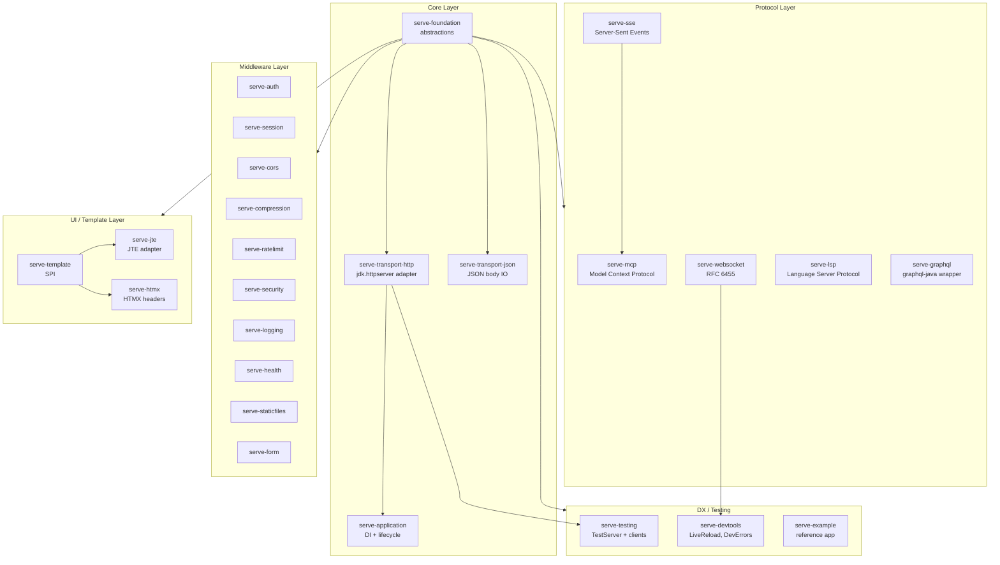
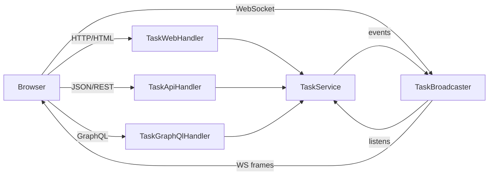
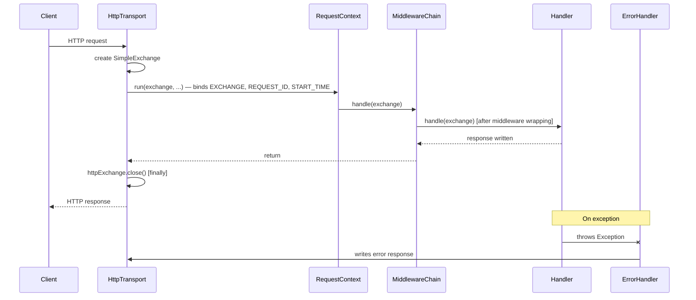
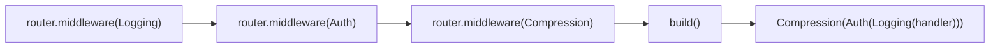
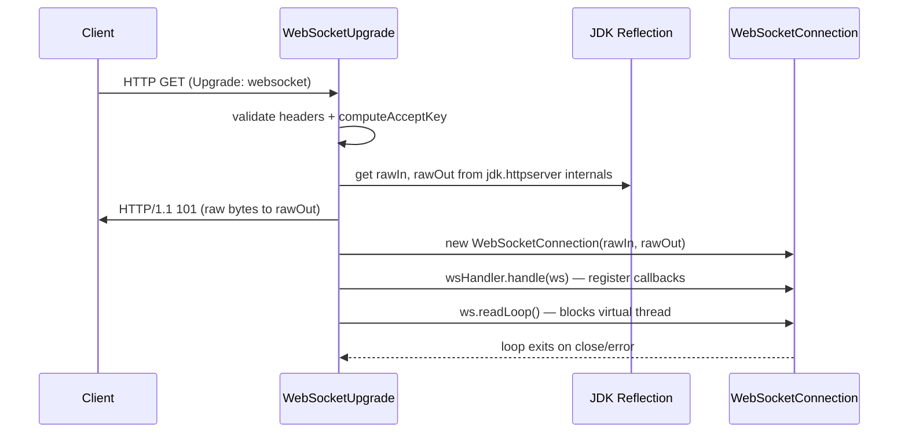
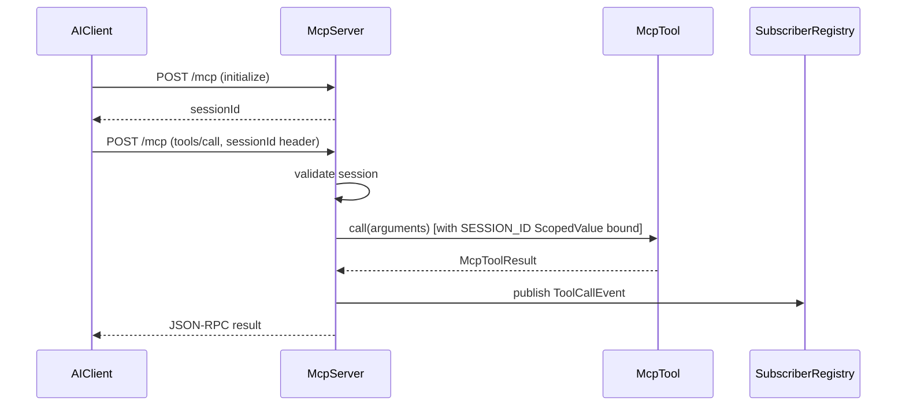

# Codebase Map

> Auto-generated by Cartographer. Last mapped: 2026-05-04

## System Overview



## Directory Structure

```
serve.build/
├── serve-foundation/          # Core abstractions — Exchange, Handler, Router, Middleware, HttpException
├── serve-transport-http/      # jdk.httpserver adapter, virtual-thread executor, TLS
├── serve-transport-json/      # JSON body reader/writer via Exchange attribute bus
├── serve-application/         # DI wiring (codemodel.build), spawn lifecycle, Launcher
│
├── serve-websocket/           # RFC 6455 WebSocket (reflection-based socket hijack)
├── serve-sse/                 # Server-Sent Events (SseEmitter, SseEvent)
├── serve-mcp/                 # Model Context Protocol 2025-03-26 (HTTP + stdio)
├── serve-lsp/                 # Language Server Protocol (stdio + TCP)
├── serve-graphql/             # graphql-java wrapper, SDL-first, GraphiQL
│
├── serve-auth/                # Bearer, Basic, ApiKey strategies; AuthContext ScopedValue
├── serve-session/             # Cookie sessions, InMemorySessionStore, SessionContext
├── serve-cors/                # CORS preflight + allowlist
├── serve-compression/         # Gzip/deflate buffering middleware
├── serve-ratelimit/           # Token-bucket rate limiting, per-key, in-process
├── serve-security/            # Security response headers (HSTS, X-Frame-Options, etc.)
├── serve-logging/             # Request access logging, TEXT + JSON formats
├── serve-health/              # Liveness + readiness handlers
├── serve-staticfiles/         # Static files from filesystem or classpath
├── serve-form/                # URL-encoded + multipart/form-data parsers
│
├── serve-template/            # Template SPI (TemplateEngine, Template, TemplateOutput, HtmlContent)
├── serve-jte/                 # JTE 3.x adapter for serve-template
├── serve-htmx/                # HtmxRequest/Response wrappers, htmxOnly() middleware
│
├── serve-testing/             # TestServer (ephemeral port), TestRequest/Response, TestWebSocket, TestSseStream
├── serve-devtools/            # LiveReload, DevErrorHandler, ChromeDevToolsHandler, ServerTimingMiddleware
├── serve-example/             # Reference app: REST + GraphQL + WebSocket + HTMX + auth + sessions
│
├── serve.build-site/          # Deno/Fresh 2 docs site (Denote framework, Deno Deploy)
├── docs/                      # CODEBASE_MAP.md, ROADMAP.md
├── config/checkstyle/         # Checkstyle config
└── pom.xml                    # Parent POM, Java 25, --enable-preview
```

## Module Guide

### serve-foundation

**Purpose:** The pure-abstraction layer — zero dependency on `jdk.httpserver`. Every module programs against these types.

**Key types:**

| Type | Role |
|------|------|
| `Exchange` | Paired request + response for one virtual-thread invocation; attribute bus (`BODY_READER_ATTRIBUTE`, `BODY_WRITER_ATTRIBUTE`, `HTTP_EXCHANGE_ATTRIBUTE`) |
| `Handler` | `@FunctionalInterface void handle(Exchange) throws Exception` |
| `Request` | Read-only request view (method, path, headers, cookies, body) |
| `Response` | Fluent response builder + send (status, headers, cookies, body) |
| `SimpleExchange` | Concrete `Exchange` impl with `ConcurrentHashMap` for attributes |
| `Router` / `RouterBuilder` | Fluent route DSL; first-registered = outermost middleware |
| `Route` / `Route.Match` | Regex-based path matching with `{param}` capture groups |
| `Middleware` | `@FunctionalInterface Handler apply(Handler next)` |
| `RequestContext` | `ScopedValue` slots: `EXCHANGE`, `REQUEST_ID`, `START_TIME`, `PRINCIPAL`, `TELEMETRY` |
| `ScopedValueMiddleware` | Generic middleware that binds any `ScopedValue<T>` per request |
| `HttpException` hierarchy | `BadRequestException`(400), `UnauthorizedException`(401), `ForbiddenException`(403), `NotFoundException`(404), `ConflictException`(409), `PayloadTooLargeException`(413), `InternalServerException`(500) |
| `ErrorHandler` / `DefaultErrorHandler` | Exception → HTTP response; `DefaultErrorHandler` strips CRLF from messages |
| `Cookie` | Immutable record + builder; `toSetCookieHeader()` |
| `Concurrent` | `StructuredTaskScope` wrappers: `fork(a,b)`, `fork(a,b,c)`, `forkAll(list)` |
| `Validate` | Input validation → `BadRequestException` |
| Option types | `ListenAddress`, `MaxRequestSize`, `RequestTimeout`, `ShutdownTimeout`, `TlsConfig` |

**Exports:** 9 JPMS packages. No JDK HTTP dependency.

**Gotchas:**
- `RouterBuilder.build()` applies middleware in **reverse** registration order so first-registered = outermost.
- Attribute bus (`bodyAsJson()`, `response().json()`) throws `UnsupportedOperationException` at runtime if `JsonMiddleware` is absent — no compile-time safety.
- Sub-router rewrite creates a new `SimpleExchange` that does NOT copy attributes from the parent exchange.

---

### serve-transport-http

**Purpose:** The only module touching `com.sun.net.httpserver`. Bridges JDK server to foundation types with one virtual thread per request.

**Key types:**

| Type | Role |
|------|------|
| `HttpTransport` | Wraps `jdk.httpserver`; virtual-thread executor; `start()` / `stop(delay)` |
| `HttpRequest` | Adapts `HttpExchange` → `Request`; caps query params (100) and cookies (50) |
| `HttpResponse` | Adapts `HttpExchange` → `Response` |
| `LimitedInputStream` | Throws `PayloadTooLargeException` at `MaxRequestSize` |
| `TimeoutExecutor` | Schedules `thread::interrupt` after `RequestTimeout` |
| `TlsOptions` / `TlsVersion` | Minimum TLS version enforcement (`TLS_1_2`, `TLS_1_3`) |

**Request lifecycle:** `HttpRequest + HttpResponse + SimpleExchange` → store raw `HttpExchange` as `HTTP_EXCHANGE_ATTRIBUTE` → `RequestContext.run(exchange, ...)` → `handler.handle(exchange)` → `errorHandler` on exception → `httpExchange.close()` in `finally`.

**Gotchas:**
- HTTPS factory overloads always pass `RequestTimeout.NONE` — request timeouts only work on plain HTTP.
- Body can only be read once (InputStream).
- TLS cipher filtering rejects unknown future TLS versions (safe-but-forward-incompatible).

---

### serve-transport-json

**Purpose:** Installs JSON body read/write capability onto `Exchange` via the attribute bus. Transport-agnostic — depends only on `serve-foundation` and `build.base.json`.

**Key types:**

| Type | Role |
|------|------|
| `JsonMiddleware` | Sets `BODY_READER_ATTRIBUTE` + `BODY_WRITER_ATTRIBUTE` on every exchange |
| `JsonBodyReader` | `request.bodyAsString()` → `JsonValue` |
| `JsonBodyWriter` | `JsonValue` → `application/json` response bytes |
| `JsonErrorHandler` | JSON-formatted error responses `{"status":N,"error":"...","message":"..."}` |

**Gotchas:**
- `JsonBodyWriter` only accepts `JsonValue`, not arbitrary POJOs — all serialization goes through `build.base.json.JsonValue`.
- `JsonErrorHandler` does not sanitize CRLF from exception messages (unlike `DefaultErrorHandler`).
- Status 413 is not in `JsonErrorHandler.statusText()` switch — returns generic `"Error"`.

---

### serve-application

**Purpose:** Glue layer wiring foundation + HTTP transport + DI (`codemodel.build`) + spawn lifecycle into a runnable server.

**Key types:**

| Type | Role |
|------|------|
| `ServerApplication.Implementation` | Abstract base class; override `configure() → Router` and optionally `errorHandler()` |
| `Launcher` | One-line entry: resolves DI, binds `ConfigurationResolver`, calls `start()` |
| `DependencyInjectionRouterBuilder` | `RouterBuilder` wrapper that accepts `Class<? extends Handler>` for DI resolution at `build()` time |

**Flow:** `Launcher.launch(server, port)` → create `InjectionFramework` + `Configuration` → bind `Context` + `TelemetryRecorder` → `context.inject(server)` → `server.start()` → `configure()` → `HttpTransport.start()`.

**Gotchas:**
- Handler classes are instantiated once at `build()` time — they must be stateless or thread-safe.
- `configure()` runs during `start()` — `@Inject` fields must be resolved first (done by `Launcher`, not if you call `start()` directly).
- `group()` is not exposed on `DependencyInjectionRouterBuilder`.

---

### serve-websocket

**Purpose:** RFC 6455 WebSocket over `jdk.httpserver` via JVM reflection to reach raw socket I/O.

**Key types:**

| Type | Role |
|------|------|
| `WebSocketUpgrade.upgrade(handler)` | Returns a `Handler`; performs handshake, runs callback, enters read loop |
| `WebSocket` | `sendText`, `sendBinary`, `ping`, `onText`, `onBinary`, `onClose`, `isOpen`, `close` |
| `WebSocketHandler` | `@FunctionalInterface void handle(WebSocket) throws Exception` |

**Gotchas:**
- Accesses 3 private JDK fields via reflection. Requires `--add-opens jdk.httpserver/sun.net.httpserver=build.serve.websocket`.
- Register callbacks inside `handle()` before it returns — the read loop starts immediately after.
- Fragment reassembly has a 16 MiB hard ceiling.
- Origin allowlist uses exact string matching only.

---

### serve-sse

**Purpose:** Server-Sent Events. `SseEvent` is also re-used by `serve-mcp` for single-shot SSE responses.

**Key types:**

| Type | Role |
|------|------|
| `SseUpgrade.sse(handler)` | Returns a `Handler`; sets SSE headers, sends chunked 200, hands `SseEmitter` to callback |
| `SseEmitter` | `send(SseEvent)`, `send(String)`, `isOpen()`, `close()` |
| `SseEvent` | Record: `data`, `id`, `event`, `retry`; `serialize()` produces wire bytes |
| `SseHandler` | `@FunctionalInterface void handle(SseEmitter) throws Exception` |

**Gotchas:**
- Sets `X-Accel-Buffering: no` unconditionally (Nginx proxy assumption).
- `SseEmitter.close()` is called in `finally` even if the handler returns normally.
- `SseEvent` canonical constructor does not enforce non-null `data` — only factory methods do.

---

### serve-mcp

**Purpose:** Model Context Protocol 2025-03-26 server — JSON-RPC 2.0 over HTTP POST or stdio. AI clients (Claude, Cursor) call registered tools.

**Key types:**

| Type | Role |
|------|------|
| `McpServer.builder(name, version)` | Entry point; `handler() → Handler` or `stdioLoop(in, out)` |
| `McpTool` | SPI: `name()`, `description()`, `inputSchema()`, `call(JsonValue) throws Exception` |
| `McpContent` | Sealed: `Text`, `Image`, `Resource` |
| `McpToolResult` | `text()`, `withResources()`, `error()` factory records |
| `McpTools` | Static helpers for building JSON Schema string-property inputs |
| `ToolCallEvent` | Published after every call: `success(...)` / `failure(...)`, includes timing |
| `McpServer.SESSION_ID` | `public static ScopedValue<String>` — bound during tool calls |

**Transports:** HTTP POST (with optional SSE response when `Accept: text/event-stream`); stdio (`"local"` session ID).

**Gotchas:**
- Session validation before body parse — invalid session ID = 404 before any JSON is read.
- Notifications (null `id`) are silently dropped with 202.
- `McpTools` only supports string-typed schema properties — complex inputs need manual `JsonObject` construction.

---

### serve-lsp

**Purpose:** Language Server Protocol over Content-Length-framed JSON-RPC 2.0 (stdio or TCP). Does not produce an HTTP `Handler` — standalone transports only.

**Key types:**

| Type | Role |
|------|------|
| `LspServer.builder()` | Dispatcher with `on*` method per LSP request/notification type |
| `LspContext` | Server-push: `publishDiagnostics`, `showMessage`, `logMessage` |
| `LspRequest` | Sealed hierarchy of 19 typed request variants |
| `LspNotification` | Sealed hierarchy of 5 notification variants |
| `LspTransport.stdio(server)` / `.tcp(server, port)` | Run loop; one virtual thread per TCP connection |
| `LspResponse` | Sealed: `Ok(value)` / `MethodNotFound` |

**Params (17 records):** `InitializeParams`, `TextDocumentPositionParams`, `DidOpenParams`, `DidChangeParams`, `CodeActionParams`, `RenameParams`, etc.

**Types (25 records):** `Position`, `Range`, `Diagnostic`, `CompletionItem`, `ServerCapabilities`, `Hover`, `InlayHint`, etc.

**Gotchas:**
- `exit` calls `Runtime.halt()` — hard JVM kill, per LSP spec.
- `showMessageRequest` response from client is silently discarded (no correlation mechanism).
- `ClientCapabilities` is an empty record — capability negotiation not implemented.
- `ServerCapabilities` only supports boolean capability flags; structured provider configs (e.g., `completionProvider.triggerCharacters`) are not representable.
- `LspTransport.tcp()` never closes its `ServerSocket`.

---

### serve-graphql

**Purpose:** SDL-first GraphQL endpoint via `graphql-java`, with optional security controls and an embedded GraphiQL IDE.

**Key types:**

| Type | Role |
|------|------|
| `GraphQlSchema.builder(sdl)` | Register `DataFetcher` implementations, build executable schema |
| `GraphQlHandler.graphql(schema)` | Returns a `Handler` for HTTP POST |
| `GraphiQlHandler.graphiql(endpoint)` | Serves bundled GraphiQL 3.9.0 IDE |
| `GraphQlOptions` | `disableIntrospection()`, `maxDepth(n)`, `maxComplexity(n)` |
| `DataFetcher<T>` | `@FunctionalInterface T fetch(DataFetchingEnvironment) throws Exception` |

**Gotchas:**
- Introspection blocking is substring-based (`__schema`, `__type`) — not AST-level; string literals containing these will be incorrectly blocked.
- HTTP status is always 200 (errors go in the response body per GraphQL spec).
- No error handling for malformed JSON request bodies.
- `opens build.serve.example.domain to com.graphqljava` is required in consuming modules for reflection-based field access.

---

### serve-auth

**Purpose:** Pluggable authentication middleware with three built-in credential strategies. Binds `Principal` to `RequestContext.PRINCIPAL` via `ScopedValue`.

**Key types:**

| Type | Role |
|------|------|
| `AuthMiddleware.builder()` | Wraps a strategy; 401 on failure, ScopedValue bind on success |
| `AuthStrategy` | `@FunctionalInterface Optional<Principal> authenticate(Request)` |
| `BearerTokenStrategy.of(validator)` | `Authorization: Bearer <token>` |
| `BasicAuthStrategy.of(realm, validator)` | `Authorization: Basic <b64>` |
| `ApiKeyStrategy.fromHeader(name, validator)` | Header-based API key |
| `ApiKeyStrategy.fromQueryParam(name, validator)` | Query-param API key (logs in plaintext) |
| `AuthStrategy.anyOf(strategies...)` | First-match composite |
| `AuthContext.current()` | `Optional<Principal>` from current scope |
| `SimplePrincipal` | `id` + `name` record |

**Gotchas:**
- `anyOf` composite always reports `challenge()` as `"Bearer"` regardless of which strategy was tried.
- `BasicAuthStrategy` uses standard Base64 decoder — URL-safe base64 fails silently.
- Checked exceptions from the downstream handler are wrapped in `RuntimeException` inside the `ScopedValue.run()` lambda.

---

### serve-session

**Purpose:** Cookie-based server-side sessions. Also bridges to auth: stores a `Principal` in session under key `"principal"` which is re-bound to `RequestContext.PRINCIPAL` automatically.

**Key types:**

| Type | Role |
|------|------|
| `SessionMiddleware.builder()` | `.store(SessionStore)` required; `.cookieName()`, `.secure(true)`, `.maxAge()` |
| `SessionStore` | SPI: `load(id)`, `save(session)`, `delete(id)` |
| `InMemorySessionStore` | TTL eviction + daemon cleanup thread; `create()` / `withTtl()` / `withTtlAndMaxSessions()` |
| `Session` | `get(key, type)`, `set(key, value)`, `invalidate()`, `isNew()` |
| `SessionContext.current()` | `Optional<Session>` from current scope |

**Gotchas:**
- `secure` defaults to `true` — must call `.secure(false)` for plain HTTP dev servers.
- Cookie is always `HttpOnly`, `SameSite=Lax`, path `/` — hardcoded, not configurable.
- When `maxSessions` is reached, new sessions are silently discarded (cookie loops on next request).
- No `close()` on `InMemorySessionStore` — daemon thread runs until JVM exit.
- If the handler throws, session save/delete does NOT execute.

---

### serve-cors

**Purpose:** Full CORS with preflight (OPTIONS → 204) and explicit origin/method/header allowlists.

**Key types:**

| Type | Role |
|------|------|
| `CorsMiddleware.builder()` | `.allowOrigin()`, `.allowAnyOrigin()`, `.allowMethod()`, `.allowHeader()`, `.allowCredentials()`, `.maxAge()` |
| `CorsMiddleware.allowAll()` | `@Deprecated` development shortcut |

**Gotchas:**
- Non-allowed origins are not rejected — the request proceeds as a non-CORS request (no CORS headers added, no 403).
- Preflight always returns 204 even if the requested method is not in the allowlist.
- `allowCredentials(true)` + `allowAnyOrigin()` throws `IllegalArgumentException` only if `allowedOrigins` is otherwise empty.

---

### serve-compression

**Purpose:** Transparent gzip/deflate response compression above a minimum size threshold.

**Key types:**

| Type | Role |
|------|------|
| `CompressionMiddleware.defaults()` | gzip, 1 KB threshold, standard content types |
| `CompressionMiddleware.builder()` | `.gzip()`, `.deflate()`, `.minimumSize(int)`, `.compressibleTypes(String...)` |

**Gotchas:**
- `BufferingResponse.bodyAsStream()` throws `UnsupportedOperationException` — streaming handlers break behind this middleware.
- `response.json(Object)` bypasses the buffer — JSON bodies sent via `.json()` are NOT compressed; use `.send(bytes)`.
- `compressibleTypes(...)` on builder **replaces** defaults rather than adding to them.
- gzip is preferred over deflate regardless of client `q` quality weights.

---

### serve-ratelimit

**Purpose:** Per-key token-bucket rate limiting, in-process. Default key = `X-Forwarded-For` header.

**Key types:**

| Type | Role |
|------|------|
| `RateLimitMiddleware.builder()` | `.limit(int)`, `.per(Duration)`, `.keyExtractor(fn)`, `.maxBuckets(int)` |

**Response headers on 429:** `Retry-After`, `X-RateLimit-Limit`, `X-RateLimit-Remaining`, `X-RateLimit-Reset`.

**Gotchas:**
- Default key extractor (`X-Forwarded-For`) is spoofable — override for non-proxy deployments.
- When `maxBuckets` is reached, new IPs get 429 with hardcoded `Retry-After: 1`.
- No bucket eviction — the map grows unboundedly until process restart.

---

### serve-security

**Purpose:** Appends security response headers after the handler chain runs.

**Key types:**

| Type | Role |
|------|------|
| `SecurityHeadersMiddleware.defaults()` | All headers at safe defaults |
| `SecurityHeadersMiddleware.builder()` | Per-header setters; `.removeHeader(name)` sets to `""` |

**Default headers:** `X-Frame-Options: DENY`, `X-Content-Type-Options: nosniff`, `X-XSS-Protection: 0`, `Strict-Transport-Security: max-age=63072000; includeSubDomains; preload`, `Referrer-Policy: strict-origin-when-cross-origin`, `Cross-Origin-Opener-Policy: same-origin`, `Cross-Origin-Resource-Policy: same-origin`.

**Gotchas:**
- Runs post-handler, unconditionally overwrites headers the handler may have already set.
- `removeHeader` sets to `""` — may or may not omit from wire depending on `jdk.httpserver` behavior.

---

### serve-logging

**Purpose:** Request access logging with nanosecond timing, slow-request escalation, path exclusions.

**Key types:**

| Type | Role |
|------|------|
| `RequestLoggingMiddleware.defaults()` | TEXT format, no headers, no query string |
| `RequestLoggingMiddleware.builder()` | `.includeHeaders(bool)`, `.includeQueryString(bool)`, `.excludePath(str)`, `.slowRequestThreshold(Duration)`, `.format(LogFormat)` |
| `LogFormat` | `TEXT` or `JSON` |

**Gotchas:**
- `includeHeaders` is silently ignored when `format = JSON`.
- Path exclusion is exact-match only — no wildcards or prefix matching.
- Exception path logs method + path + duration + exception class but not the HTTP status.

---

### serve-health

**Purpose:** Liveness and readiness handlers.

**Key types:**

| Type | Role |
|------|------|
| `HealthHandler.liveness()` | Always 200 `{"status":"UP"}` |
| `HealthHandler.readiness(checks...)` | 200 if all pass; 503 if any fail |
| `HealthHandler.create()` | Builder that assembles a `Router` with both endpoints |
| `HealthCheck` | `@FunctionalInterface boolean check() throws Exception`; `of(name, check)` |

**Gotchas:**
- All checks run synchronously on the request thread — no timeout.
- Multiple unnamed checks collide in the JSON output map.

---

### serve-staticfiles

**Purpose:** Static files from filesystem or classpath, implementing `Router` for prefix mounting.

**Key types:**

| Type | Role |
|------|------|
| `StaticFileHandler.directory(path)` | Filesystem; index defaults to `"index.html"` |
| `StaticFileHandler.resources(anchorClass, prefix)` | Classpath; no index default |
| `StaticFileHandler.builder()` | `.directory()` / `.resources()`, `.index()`, `.cacheControl()` |

**Features:** MIME type detection (25 extensions + `Files.probeContentType`), ETag/304 caching, path traversal protection (string + filesystem containment checks).

**Gotchas:**
- Entire file loaded into memory via `Files.readAllBytes()` — no streaming.
- Classpath mode has no ETag / 304 support.
- ETags based on `mtime + size` — collisions possible.

---

### serve-form

**Purpose:** Stateless body parsers called directly in handlers (not middleware).

**Key types:**

| Type | Role |
|------|------|
| `FormData.from(request)` | Parses `application/x-www-form-urlencoded`; `get(name)`, `getAll(name)` |
| `MultipartData.from(request)` | Parses `multipart/form-data`; `get(name)`, `parts()` |
| `FormPart` | `name()`, `filename()`, `contentType()`, `bytes()`, `value()` |

**Gotchas:**
- No Content-Type validation — both parsers will attempt to parse any body.
- `MultipartData` reads entire body into memory — no size limits; OOM risk on large uploads.
- RFC 5987 encoded filenames (`filename*=UTF-8''...`) are silently ignored.
- Parts without a `name` in `Content-Disposition` are silently dropped.

---

### serve-template

**Purpose:** Engine-agnostic template SPI. All application code programs against these types; engine implementations swap without touching handler code.

**Key types:**

| Type | Role |
|------|------|
| `TemplateEngine` | `@FunctionalInterface template(name) → Template` |
| `Template` | `@FunctionalInterface render(TemplateOutput, Map<String,Object>) throws Exception` |
| `TemplateOutput` | Output sink; static factories `capture()`, `of(Writer)`, `of(OutputStream)` |
| `HtmlContent` | `@FunctionalInterface String get()` — a rendered HTML string producer |
| `TemplateHandler` | `Handler` that renders a named template and sends `text/html` |
| `StringTemplateOutput` | In-memory capture; `get()` returns rendered string |

**Gotchas:**
- `writeUserContent` has no default escaping — engines must implement their own escaping.
- `TemplateHandler` always buffers the full render before sending — no streaming.

---

### serve-jte

**Purpose:** Adapter wiring JTE 3.x into the `serve-template` SPI.

**Key types:**

| Type | Role |
|------|------|
| `JteTemplateEngine.development(sourcePath)` | Hot-reload mode with temp directory for compiled classes |
| `JteTemplateEngine.production(anchorClass)` | Precompiled classpath mode |
| `JteTemplateEngine.production(classDir)` | Precompiled directory mode |

**Gotchas:**
- `development()` creates a temp directory per JVM start — accumulates without cleanup.
- `template(name)` is eager — validates existence at lookup time, not render time.
- Only `ContentType.Html` is supported.

---

### serve-htmx

**Purpose:** Typed Java wrappers for HTMX `HX-*` request/response headers and a guard middleware.

**Key types:**

| Type | Role |
|------|------|
| `HtmxRequest.of(request)` | Typed accessors: `isHtmxRequest()`, `target()`, `triggerName()`, etc. |
| `HtmxResponse.of(response)` | Fluent setters: `pushUrl()`, `retarget()`, `reswap()`, `trigger()`, `send(HtmlContent)` |
| `HtmxMiddleware.htmxOnly()` | Returns 400 for non-HTMX requests |
| `HtmxHeaders` | String constants for all `HX-*` header names |

**Gotchas:**
- `htmxOnly()` returns 400 (Bad Request) — 406 (Not Acceptable) would be more conventional.
- Requires `build.serve.template` transitively just for `HtmlContent`.

---

### serve-testing

**Purpose:** Integration test infrastructure — `TestServer` on an ephemeral port with fluent assertion-rich HTTP, WebSocket, and SSE clients. Ships as a production artifact (not `src/test`) to be re-exported to consumer modules.

**Key types:**

| Type | Role |
|------|------|
| `TestServer.of(handler)` | Binds to `127.0.0.1:0`; `get/post/put/delete(path) → TestRequest`; `connectWebSocket(path)`, `sse(path)` |
| `TestRequest` | Fluent builder: `header()`, `body()`, `jsonBody()`, `send() → TestResponse` |
| `TestResponse` | `assertStatus()`, `assertBody()`, `assertHeader()`, `bodyAsJson()` |
| `TestWebSocket` | Queue-based; `sendText()`, `nextText(timeout)`, `assertClosed()` |
| `TestSseStream` | `collect(n, timeout)`, `collectAll(timeout)` → `List<TestSseEvent>` |

**Gotchas:**
- Uses `HttpURLConnection` for plain HTTP — no redirect following on non-GET, no HTTP/2.
- Error stream fallback returns empty body if `getErrorStream()` is null.
- `TestWebSocket.nextText()` has a hardcoded 5-second default timeout.
- Both WS and SSE clients use virtual threads internally for pumping.

---

### serve-devtools

**Purpose:** Development-time browser and editor integrations. Not for production.

**Key types:**

| Type | Role |
|------|------|
| `LiveReload.watching(paths...)` | FS watcher + WebSocket broadcaster; `handler()` for upgrade route, `scriptTag()` for HTML injection |
| `DevErrorHandler.builder()` | HTML error page with stack traces and `open in editor` deep-links |
| `Editor` | Enum: `VSCODE`, `INTELLIJ`, `ZED`, `SUBLIME`; `fromSystemProperty()` reads `-Dserve.devtools.editor` |
| `ChromeDevToolsHandler` | Serves `/.well-known/appspecific/com.chrome.devtools.json`; stable UUID from project root path |
| `ServerTimingMiddleware` | Injects `Server-Timing: total;dur=X.X` header at response commit time |
| `FaviconHandler` | `empty()` (204), `of(bytes, type)`, `fromClasspath(resource)` |

**Gotchas:**
- `ChromeDevToolsHandler` exposes the absolute filesystem path of the project root — do not register in production.
- `LiveReload.close()` does not `join()` the watcher thread.
- `DevErrorHandler` generates HTML via `StringBuilder` (no template engine dependency).

---

### serve-example

**Purpose:** Full reference application demonstrating all framework capabilities.

**Stack:** REST API + GraphQL + WebSocket broadcasting + HTMX web UI + session auth + API-key auth + rate limiting + health + devtools.

**Key files:**
- `ExampleApp` — assembles the full middleware stack and router; the canonical pattern to follow.
- `TaskService` — thread-safe in-memory domain with observer notifications.
- `TaskApiHandler` — REST with JSON body validation.
- `TaskGraphQlHandler` — SDL-first GraphQL with mutations.
- `TaskWebHandler` — HTMX partial responses using `base-template` generated template classes.
- `TaskBroadcaster` — WebSocket fan-out on domain events.

**Route map:**
```
GET  /                       → full page (HTMX base template)
POST /tasks                  → create task, return HTMX partial
PUT  /tasks/{id}/toggle      → toggle done, return HTMX partial
DELETE /tasks/{id}           → delete, return empty 200

GET  /api/tasks              → JSON list
POST /api/tasks              → JSON create → 201
PUT  /api/tasks/{id}         → JSON update → 200
DELETE /api/tasks/{id}       → 204

POST /graphql                → GraphQL execution
GET  /graphiql               → GraphiQL IDE

GET  /ws/tasks               → WebSocket upgrade (broadcasts task events as JSON)

GET  /health/live            → {"status":"UP"}
GET  /health/ready           → {"status":"UP","checks":{...}}
```

**Key domain types:**

| Type | Pattern |
|---|---|
| `Task(long id, String title, boolean done)` | Immutable Java record |
| `TaskService` | `ConcurrentHashMap` + `AtomicLong` + `CopyOnWriteArrayList<Consumer<TaskEvent>>` |
| `TaskEvent(String type, Task task)` | Nested record; types: `"created"`, `"updated"`, `"deleted"` |
| `TaskBroadcaster` | `CopyOnWriteArrayList<WebSocket>` sessions; dead session cleanup on broadcast |

**Architecture:**


---

### serve.build-site

**Purpose:** Documentation website built with Deno + Fresh 2 + Denote framework, deployed to Deno Deploy.

**Key files:**
- `denote.config.ts` — site structure, nav, colors, landing page, SEO, analytics, MCP integration.
- `content/docs/*.md` — six doc pages: introduction, quickstart, routing, middleware, protocols, installation.
- `deno.json` — tasks: `dev`, `build`, `start`, `ok` (format+lint+typecheck+validate).

**Note:** Doc content for `GraphQlOptions` (depth/complexity limits) and GraphiQL SRI hashes is outdated relative to current implementation.

---

## Data Flow

### HTTP Request Lifecycle



### Middleware Chain Construction



First registered = outermost. Applied in reverse during `build()`.

### WebSocket Upgrade Flow



### MCP Tool Call Flow



## Conventions

- **4-space indentation** everywhere (accessibility standard).
- **Null-free public APIs**: use `Optional<T>` instead of null.
- **Test method names** must start with `should` or `shouldNot`.
- **No mocks**: use stub implementations (`TestServer`, `StubRequest`, `StubResponse`).
- **Middleware order**: first-registered = outermost (applied in reverse in `RouterBuilder.build()`).
- **Attribute bus**: capabilities are installed on `Exchange` by middleware via named string keys; feature detection is runtime-only.
- **ScopedValue for context**: `RequestContext` binds values that propagate automatically into `StructuredTaskScope` subtasks.
- **DI at startup**: handler instances are resolved once at `build()` time, not per request.
- **No POJO serialization**: JSON goes through `build.base.json.JsonValue` — no Jackson reflection.

## Gotchas

- `RouterBuilder` middleware order is **reversed** at `build()` time — the first `.middleware()` call is the outermost wrapper.
- `bodyAsJson()` / `response().json()` throw `UnsupportedOperationException` at runtime if `JsonMiddleware` is not in the chain.
- Sub-router path rewriting creates a new `SimpleExchange` that loses parent exchange attributes (except path params).
- WebSocket reflection accesses JDK internals — requires `--add-opens jdk.httpserver/sun.net.httpserver=build.serve.websocket`. Any JDK restructuring will break it.
- HTTPS transport ignores `RequestTimeout` — timeouts only work on plain HTTP.
- `CompressionMiddleware` breaks streaming handlers (`bodyAsStream()` throws `UnsupportedOperationException` inside the buffer).
- `SessionMiddleware`: `secure` defaults to `true`; session save skips on handler exception.
- `InMemorySessionStore` and `RateLimitMiddleware` are single-process only — no distributed store provided.
- `GraphQlOptions.disableIntrospection()` uses substring matching, not AST analysis.
- `serve-devtools` (`ChromeDevToolsHandler`) exposes the project root path — never register in production.

## Navigation Guide

**To add a new route:**
1. Register in `ServerApplication.Implementation.configure()` via `RouterBuilder.get/post/...`.
2. Implement `Handler` (or `class MyHandler implements Handler` with `@Inject` fields for DI).

**To add JSON API support:**
1. Add `JsonMiddleware` to the router or route group.
2. Use `exchange.bodyAsJson()` to read; `exchange.response().json(jsonValue)` to write.
3. Register `JsonErrorHandler` on `HttpTransport` for JSON error responses.

**To add authentication:**
1. Create an `AuthStrategy` (Bearer / Basic / ApiKey or custom).
2. Add `AuthMiddleware.builder().strategy(strategy).build()` to the route group.
3. Read the principal via `AuthContext.current()` in handlers.

**To add WebSocket support:**
1. Register a route: `router.get("/ws", WebSocketUpgrade.upgrade(ws -> { ... }))`.
2. Register callbacks inside the handler; the read loop starts when the handler returns.

**To add MCP tools:**
1. `McpServer.builder(name, version).tool(new MyTool()).build().handler()`.
2. Register the handler at any route path.
3. Or run `stdioLoop(System.in, System.out)` for stdio transport.

**To add GraphQL:**
1. `GraphQlSchema.builder(sdlString).fetcher("Query", "field", env -> ...).build()`.
2. Register `GraphQlHandler.graphql(schema)` at a POST route.
3. Optionally register `GraphiQlHandler.graphiql("/graphql")` at a GET route.

**To write integration tests:**
1. `TestServer.of(router)` in `@BeforeEach` — auto-binds to an ephemeral port.
2. `server.get("/path").send().assertStatus(200).assertBodyContains("hello")`.
3. Use `server.connectWebSocket("/ws")` or `server.sse("/events")` for protocol tests.

**To add template rendering:**
1. Add `serve-template` + either `serve-jte` or implement your own `TemplateEngine`.
2. Use `TemplateHandler.render(engine, "template-name", exchange -> Map.of("key", value))`.
3. Or use `HtmxResponse.of(response).send(htmlContent)` for HTMX partial responses.

**To add LSP support:**
1. `LspServer.builder().onInitialize(...).onHover(...).build()`.
2. `LspTransport.stdio(server)` or `LspTransport.tcp(server, port)`.
3. LSP does not integrate with the HTTP router — it is a standalone protocol loop.
