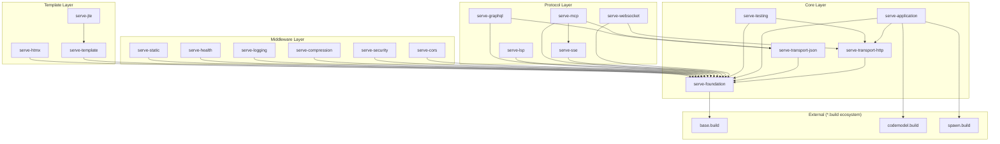
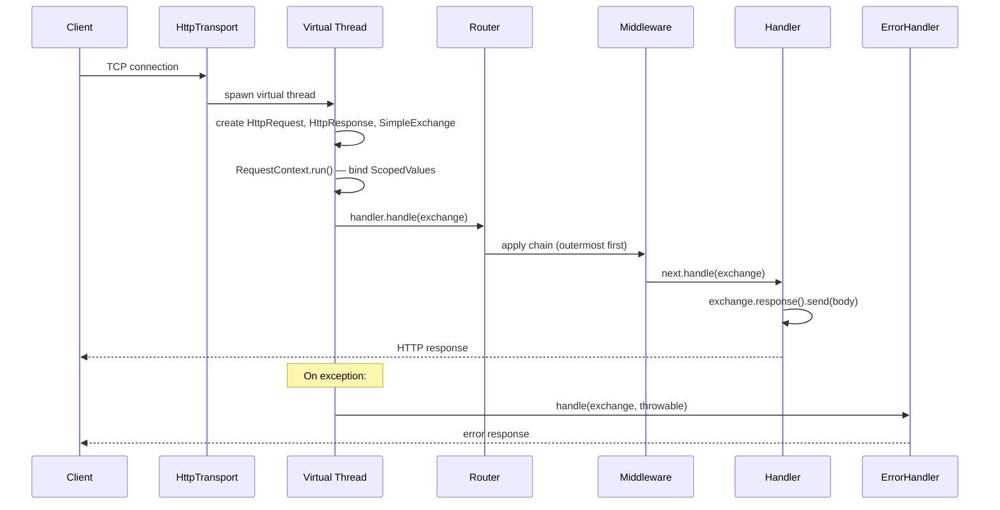
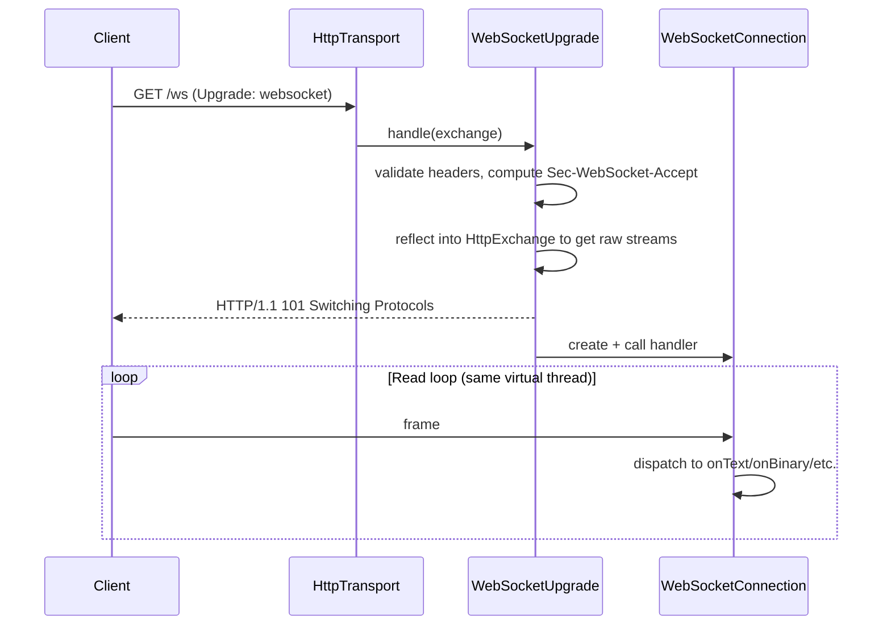
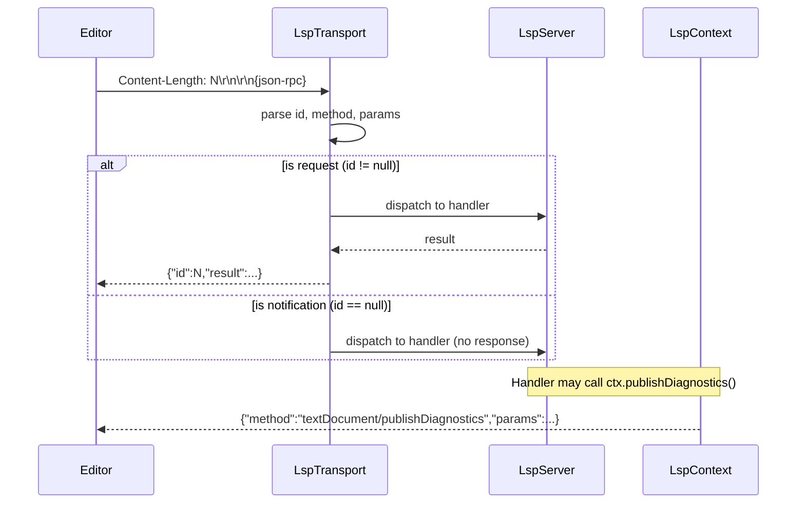

# Codebase Map

> Auto-generated by Cartographer. Last mapped: 2026-03-31

## System Overview



## Directory Structure

```
serve.build/
├── serve-foundation/           Core abstractions: Exchange, Handler, Router, Middleware
├── serve-transport-http/       JDK HttpServer adapter (the wire layer)
├── serve-transport-json/       Jackson JSON body reading/writing middleware
├── serve-application/          Server lifecycle + DI integration (spawn + codemodel)
├── serve-testing/              TestServer, TestRequest, TestResponse for integration tests
│
├── serve-websocket/            RFC 6455 WebSocket support (raw frame implementation)
├── serve-sse/                  Server-Sent Events (RFC 8895)
├── serve-mcp/                  Model Context Protocol (JSON-RPC 2.0 over HTTP)
├── serve-lsp/                  Language Server Protocol (JSON-RPC over stdio)
├── serve-graphql/              GraphQL over HTTP (graphql-java backed)
│
├── serve-cors/                 CORS middleware
├── serve-security/             Security headers middleware (HSTS, CSP, etc.)
├── serve-compression/          Gzip/deflate response compression
├── serve-logging/              Request/response access logging
├── serve-health/               Liveness + readiness health check endpoints
├── serve-static/               Static file serving from filesystem or classpath
│
├── serve-template/             Engine-agnostic template abstraction SPI
├── serve-jte/                  JTE (Java Template Engine) implementation
├── serve-htmx/                 HTMX request/response header helpers
│
├── config/checkstyle/          Checkstyle rules (Google style + 4-space indent)
├── pom.xml                     Root multi-module POM (Java 25, preview features)
└── README.md                   Project overview, quick-start, feature matrix
```

---

## Module Guide

### serve-foundation

**Purpose**: Core abstractions that every other module builds on. The only module that depends directly on `base.build`.

**Entry point**: `build.serve.foundation` package — start with `Exchange`, `Handler`, `RouterBuilder`.

**Key files**:
| File | Purpose |
|------|---------|
| `Exchange.java` | Per-request context: pairs Request + Response, typed attribute bag |
| `Handler.java` | `@FunctionalInterface` — `void handle(Exchange) throws Exception` |
| `Request.java` | Read-only view of an inbound HTTP request |
| `Response.java` | Write-only view of an outbound HTTP response |
| `SimpleExchange.java` | `ConcurrentHashMap`-backed implementation of `Exchange` |
| `routing/RouterBuilder.java` | Fluent route registration; builds the dispatch `Router` |
| `routing/Route.java` | Compiles path patterns (`{name}`) to regex at construction |
| `routing/Router.java` | Marker interface: `Router extends Handler` |
| `middleware/Middleware.java` | `@FunctionalInterface` — `Handler apply(Handler next)` |
| `context/RequestContext.java` | `ScopedValue` slots: `EXCHANGE`, `REQUEST_ID`, `PRINCIPAL`, `START_TIME`,
`TELEMETRY` |
| `context/ScopedValueMiddleware.java` | Generic middleware for binding any `ScopedValue` |
| `concurrent/Concurrent.java` | Structured concurrency utilities: `fork(A,B)`, `fork(A,B,C)`, `forkAll(List)` |
| `error/HttpException.java` | Base exception with status code; subtypes: 400/401/403/404/409/500 |
| `error/DefaultErrorHandler.java` | Plain-text error handler; does NOT leak stack traces |
| `error/ErrorHandler.java` | `@FunctionalInterface` — `void handle(Exchange, Throwable)` |
| `http/Cookie.java` | Immutable record + Builder for `Set-Cookie` headers |
| `option/*.java` | `ListenAddress`, `MaxRequestSize`, `ShutdownTimeout`, `TlsConfig` |

**Key design decisions**:

- `Exchange.bodyAs(Class)` and `Exchange.sendBody(Object)` delegate to `_bodyReader`/`_bodyWriter` attributes set by
  transport middleware (e.g., `JsonMiddleware`). Calling them without a transport middleware throws
  `UnsupportedOperationException`.
- `RouterBuilder` applies middleware in **reverse registration order** — first-registered wraps outermost.
- `Route` path params use `{name}` syntax compiled to regex capture groups. Trailing slashes on *request paths* do NOT
  match patterns without them.
- Nested routers get a `PrefixStrippedRequest` — the remaining path after the mount prefix. Query string is preserved
  via `queryParams()` but `uri()` only holds the stripped path.
- `RequestContext.run()` binds `EXCHANGE`, `REQUEST_ID`, and `START_TIME`. `PRINCIPAL` and `TELEMETRY` are declared but
  must be bound explicitly (e.g., via `ScopedValueMiddleware`).
- `Concurrent.fork()` uses `StructuredTaskScope.open()` (ShutdownOnFailure policy). Scoped values are automatically
  inherited into forked subtasks.

**Dependencies**: `base.build` modules (all `requires transitive`).

---

### serve-transport-http

**Purpose**: Adapts the JDK's built-in `com.sun.net.httpserver.HttpServer` to the serve-foundation interfaces. Every
request runs on a **virtual thread**.

**Key files**:
| File | Purpose |
|------|---------|
| `HttpTransport.java` | Starts/stops the JDK server; one virtual thread per request |
| `HttpRequest.java` | `Request` impl wrapping JDK `HttpExchange`; back-references parent `Exchange` |
| `HttpResponse.java` | `Response` impl; once `send()` is called headers are committed |

**Request lifecycle**:

1. JDK `HttpServer` receives request → dispatches on virtual thread
2. `HttpRequest` + `HttpResponse` created, cross-linked to a `SimpleExchange`
3. Raw `HttpExchange` stored as `exchange.attribute("_httpExchange", ...)` (used by WebSocket/SSE)
4. `RequestContext.run(exchange, ...)` binds scoped values
5. `handler.handle(exchange)` called (typically the `Router`)
6. Exceptions → `ErrorHandler.handle(exchange, e)`
7. `httpExchange.close()` in `finally`

**Gotchas**:

- `HttpResponse.send()` commits the response — further header modifications after this are silently ignored.
- `HttpResponse.bodyAsStream()` calls `sendResponseHeaders(status, 0)` (chunked) then returns the raw stream — caller
  must close.
- The `_httpExchange` attribute is a required contract for `WebSocketUpgrade` and `SseUpgrade`.

**Dependencies**: `build.serve.foundation` (transitive), `jdk.httpserver`.

---

### serve-transport-json

**Purpose**: Registers Jackson-based body reading/writing on the exchange attribute bag, enabling
`exchange.bodyAs(Class)` and `exchange.sendBody(Object)`.

**Key files**:
| File | Purpose |
|------|---------|
| `JsonMiddleware.java` | Sets `_bodyReader`/`_bodyWriter` attributes; must be registered before handlers |
| `JsonBodyReader.java` | Deserializes JSON from request stream via `ObjectMapper` |
| `JsonBodyWriter.java` | Serializes to JSON bytes, sets `Content-Type: application/json; charset=utf-8` |
| `JsonErrorHandler.java` | `ErrorHandler` producing `{"status":N,"error":"...","message":"..."}` |

**Gotchas**:

- `JsonMiddleware` must be registered **before** route handlers in `RouterBuilder`. Because middleware is applied in
  reverse, `.middleware(new JsonMiddleware())` at the end of the builder chain is correct.
- `JsonErrorHandler` sets `Content-Type: application/json` (no charset), unlike `JsonBodyWriter`.
- `ObjectMapper` is shared across requests — thread-safe by design.

**Dependencies**: `build.serve.foundation` (transitive), `com.fasterxml.jackson.databind`.

---

### serve-application

**Purpose**: Full server lifecycle with DI wiring. Implements `spawn.build`'s `Lifecycle` and `Addressable`.

**Key files**:
| File | Purpose |
|------|---------|
| `ServerApplication.java` | Interface + abstract `Implementation` — subclass and override `configure()` |
| `Launcher.java` | Wires DI context, injects the server, then calls `server.start()` |
| `DependencyInjectionRouterBuilder.java` | RouterBuilder wrapper that accepts `Class<Handler>` for DI-constructed
handlers |

**Usage pattern**:

```java
class MyServer extends ServerApplication.Implementation {
    @Inject
    Port port;
    @Inject
    MyService service;

    @Override
    protected Router configure() {
        return DependencyInjectionRouterBuilder.create(context())
            .get("/hello", MyHandler.class)
            .build();
    }
}

// Start:
Launcher.

launch(new MyServer(),Port.

of(8080));
```

**Gotchas**:

- `configure()` is called during `start()`, NOT at construction time — injected `@Inject` fields are populated by the
  time `configure()` runs.
- Handler classes passed to `DependencyInjectionRouterBuilder` are instantiated at `build()` time, not per-request —
  effectively singletons.
- `stop()` is guarded by `AtomicBoolean` — safe to call multiple times.
- Shutdown hook thread is registered on `start()` and removed on `stop()`.

**Dependencies**: `build.serve.foundation` (transitive), `build.serve.transport.http` (transitive),
`build.spawn.application` (transitive), `build.codemodel.injection` (transitive), `jakarta.inject` (transitive).

---

### serve-testing

**Purpose**: Integration test utilities. Binds to ephemeral port 0; provides fluent request builder and assertion
wrapper.

**Key files**:
| File | Purpose |
|------|---------|
| `TestServer.java` | `AutoCloseable` wrapper around `HttpTransport`; `of(Handler/Router/RouterBuilder)` |
| `TestRequest.java` | Fluent builder for test HTTP requests via `HttpURLConnection` |
| `TestResponse.java` | Fluent assertions: `assertStatus`, `assertBody`, `assertHeader`, `bodyAs(Class)` |

**Usage**:

```java
try(var server = TestServer.of(RouterBuilder.create()
    .get("/hello", e -> e.response().send("Hello"))
    .build())){
    server.

get("/hello").

send().

assertStatus(200).

assertBody("Hello");
}
```

**Gotchas**:

- `TestResponse.assertContentType` uses `contains()` not `equals()` — `"application/json"` matches
  `"application/json; charset=utf-8"`.
- `serve-testing`'s module-info re-exports `junit.jupiter.api` and `assertj.core` transitively — consumer test modules
  do NOT need to re-declare those.

**Dependencies**: `build.serve.foundation` (transitive), `build.serve.transport.http` (transitive),
`org.junit.jupiter.api` (transitive), `org.assertj.core` (transitive).

---

### serve-websocket

**Purpose**: Full RFC 6455 WebSocket implementation from scratch — no external WebSocket library.

**Key files**:
| File | Purpose |
|------|---------|
| `WebSocketUpgrade.java` | Performs HTTP→WebSocket handshake via reflection on JDK internals |
| `WebSocketConnection.java` | RFC 6455 frame loop: text/binary/ping/pong/close, fragmentation, 16MB limit |
| `WebSocketFrame.java` | (package-private) reads/writes wire frame format |
| `WebSocketHandler.java` | `@FunctionalInterface` — `void handle(WebSocket) throws Exception` |
| `WebSocket.java` | Public connection API: `sendText`, `sendBinary`, `onText`, `onBinary`, etc. |

**Usage**:

```java
RouterBuilder.create()
    .

get("/ws",WebSocketUpgrade.upgrade(ws ->{
    ws.

onText(msg ->ws.

sendText("echo: "+msg));
    }))
    .

build();
```

**Gotchas**:

- `WebSocketUpgrade` uses **reflection on JDK internals** (`HttpExchangeImpl.impl.connection`) to get raw streams. A JDK
  update changing these private fields/methods will break this silently at runtime.
- Requires the `_httpExchange` attribute set by `HttpTransport` — fails with `IllegalStateException` otherwise.
- Handlers run on the read loop's virtual thread — a slow or blocking handler stalls the connection.
- Server sends unmasked frames (correct per RFC 6455 §5.1).
- Frame size limit: 16 MB.

**Dependencies**: `build.serve.foundation` (transitive), `build.serve.transport.http`, `jdk.httpserver`,
`java.net.http`.

---

### serve-sse

**Purpose**: Server-Sent Events (RFC 8895) — streaming text events from server to client over a persistent HTTP
connection.

**Key files**:
| File | Purpose |
|------|---------|
| `SseUpgrade.java` | Sets SSE headers, commits response via raw `HttpExchange`, calls handler |
| `SseEmitter.java` | Public interface: `send(String)`, `send(SseEvent)`, `isOpen()`, `close()` |
| `SseEmitterImpl.java` | Synchronized implementation writing to the response `OutputStream` |
| `SseEvent.java` | Record: `data`, `id`, `event`, `retry` — `toWireFormat()` for RFC 8895 framing |
| `SseHandler.java` | `@FunctionalInterface` — `void handle(SseEmitter) throws Exception` |

**Usage**:

```java
RouterBuilder.create()
    .

get("/events",SseUpgrade.sse(emitter ->{
    for(
int i = 0;
i< 10;i++){
    emitter.

send("event-"+i);
            Thread.

sleep(1000);
        }
            }))
            .

build();
```

**Gotchas**:

- `SseEvent.of(event, data)` parameter order is `(event, data)` but the record field order is
  `(data, id, event, retry)` — easy to swap.
- Like WebSocket, requires `_httpExchange` attribute from `HttpTransport`.
- `send()` is synchronous and blocking — no backpressure mechanism.
- Disconnect detection: only via `IOException` thrown from `send()`.

**Dependencies**: `build.serve.foundation` (transitive), `jdk.httpserver`, `java.net.http`.

---

### serve-mcp

**Purpose**: Model Context Protocol server — JSON-RPC 2.0 over HTTP POST, exposing a registry of typed tools to AI
clients (e.g., Claude).

**Key files**:
| File | Purpose |
|------|---------|
| `McpServer.java` | HTTP handler: initialize, tools/list, tools/call; returns HTTP 200 always |
| `McpTool.java` | Interface: `name()`, `description()`, `inputSchema()`, `call(JsonNode) throws Exception` |
| `McpContent.java` | Sealed: `Text(String)` and `Image(String data, String mimeType)` |
| `McpToolResult.java` | Record: `List<McpContent> content`, `boolean isError` |
| `McpTools.java` | Static helpers to build JSON Schema `ObjectNode` for tool inputs |
| `McpServerInfo.java` | Record: `name`, `version` |

**Usage**:

```java
var server = McpServer.builder()
    .serverInfo(new McpServerInfo("my-server", "1.0"))
    .tool(new MyTool())
    .build();

RouterBuilder.

create()
    .

post("/mcp",server.handler())
    .

build();
```

**Gotchas**:

- Protocol version hardcoded to `"2025-03-26"`.
- `McpTools.schema()` only builds string-typed properties — other types require manual `ObjectNode` construction.
- Tool exceptions are caught and returned as `McpToolResult.error(e.getMessage())` — `null` message produces
  `{"text":null}`.
- Notifications (no `id` field) return HTTP 202 with empty body.
- The `requires build.serve.sse` dependency in the module descriptor is currently unused.

**Dependencies**: `build.serve.foundation` (transitive), `build.serve.sse`, `build.serve.transport.json`,
`com.fasterxml.jackson.databind`.

---

### serve-lsp

**Purpose**: Language Server Protocol implementation over stdio (or any `InputStream`/`OutputStream`). Not an HTTP
handler — runs on a dedicated thread reading JSON-RPC framed messages.

**Key files**:
| File | Purpose |
|------|---------|
| `LspTransport.java` | Stateless: reads frames, dispatches to `LspServer`, writes responses |
| `LspServer.java` | Pure data: holds all handler registrations (all default to `null`) |
| `LspContext.java` | Interface passed to handlers; enables server-initiated notifications |
| `*Params.java` | Records for each LSP method's parameter payload |
| `types/*.java` | LSP domain types: `Position`, `Range`, `Diagnostic`, `Hover`, `CompletionItem`, etc. |

**Wire format**: `Content-Length: N\r\n\r\n{json}` — HTTP-like header framing.

**Usage**:

```java
LspTransport.stdio(LspServer.builder()
    .

onInitialize(params ->ServerCapabilities.

builder()
        .

hoverProvider(true)
        .

completionProvider(true)
        .

build())
    .

onHover((params, ctx) ->Hover.

of("**"+params.textDocument().

uri() +"**"))
    .

build());
```

**Gotchas**:

- Read loop is single-threaded — slow handlers block the entire session.
- `exit` calls `Runtime.halt()`, bypassing all JVM shutdown hooks.
- Exceptions thrown by handlers are swallowed, returning `{"result":null}` to the client.
- `DiagnosticSeverity` and `SymbolKind` enums serialize as their name (e.g., `"ERROR"`) by default — LSP clients expect
  integers; custom Jackson serialization is needed.
- `showMessageRequest` is sent as a notification, not a real request-response.
- `isKnownMethod` private method is dead code.
- The `@param capabilities` field in `InitializeParams` is typed as `Object` (becomes `LinkedHashMap`).

**Dependencies**: `build.serve.foundation` (transitive), `com.fasterxml.jackson.databind`.

---

### serve-graphql

**Purpose**: GraphQL over HTTP using graphql-java as the execution engine; schema-first (SDL string).

**Key files**:
| File | Purpose |
|------|---------|
| `GraphQlSchema.java` | Parses SDL, builds `RuntimeWiring`, returns an executor |
| `GraphQlHandler.java` | `Handler` factory: reads POST body, calls `schema.execute()`, sends JSON |
| `GraphiQlHandler.java` | Serves GraphiQL browser IDE (loads from esm.sh CDN) |
| `DataFetcher<T>` | `@FunctionalInterface` — `T fetch(DataFetchingEnvironment) throws Exception` |
| `DataFetchingEnvironment` | `getArgument(name)`, `getSource()`, `getField()` |
| `GraphQlResult` | `Map<String,Object> data`, `List<GraphQlError> errors` |

**Usage**:

```java
var schema = GraphQlSchema.builder("""
            type Query { hello(name: String): String }
        """)
    .fetcher("Query", "hello", env -> "Hello, " + env.getArgument("name"))
    .build();

RouterBuilder.

create()
    .

post("/graphql",GraphQlHandler.graphql(schema))
    .

get("/graphiql",GraphiQlHandler.graphiql("/graphql"))
    .

build();
```

**Gotchas**:

- All GraphQL errors (parse, validation, execution) produce **HTTP 200** — errors appear in the JSON `errors` array.
- GraphiQL IDE requires internet access to load from `esm.sh` CDN.
- `GraphiQlHandler` has no XSS protection on the injected `endpoint` string.
- `getArgument` and `getSource` use unchecked casts — `ClassCastException` at runtime on type mismatch.

**Dependencies**: `build.serve.foundation` (transitive), `build.serve.transport.json`, `com.fasterxml.jackson.databind`,
`com.graphqljava`.

---

### serve-cors

**Purpose**: CORS middleware with origin allowlist, method/header whitelisting, credentials, and preflight support.

**Key API**: `CorsMiddleware.allowAll()` (dev-only) or `CorsMiddleware.builder()...build()`.

**Gotchas**:

- Unknown origins: request still proceeds, no CORS headers set (silent pass-through — not blocked).
- Preflight (OPTIONS + allowed origin): downstream handler is NOT called; always `204 No Content`.
- Credentials + wildcard origin throws `IllegalArgumentException` at build time.
- `allowAnyOrigin()` omits `Vary: Origin` header.

---

### serve-security

**Purpose**: Applies HTTP security response headers after the handler runs.

**Key API**: `SecurityHeadersMiddleware.defaults()` or `SecurityHeadersMiddleware.builder()...build()`.

**Default headers**: `X-Frame-Options: DENY`, `X-Content-Type-Options: nosniff`, `X-XSS-Protection: 0`,
`HSTS: max-age=63072000`, `Referrer-Policy: strict-origin-when-cross-origin`, `COOP: same-origin`, `CORP: same-origin`.
CSP and Permissions-Policy are **not set by default** (too application-specific).

**Gotchas**:

- HSTS is set unconditionally — including on HTTP responses. Use only behind TLS.
- `removeHeader(name)` sets the value to `""`, not an actual header removal API call.

---

### serve-compression

**Purpose**: Gzip/deflate response compression with content-type filtering and minimum size threshold.

**Key API**: `CompressionMiddleware.defaults()` (gzip, 1 KB min, standard types) or
`CompressionMiddleware.builder()...build()`.

**Gotchas**:

- Uses a buffering response wrapper — `bodyAsStream()` throws `UnsupportedOperationException` when active.
- `response.json(Object)` bypasses the buffer and will NOT be compressed.
- Gzip takes priority over deflate regardless of client `Accept-Encoding` ordering.
- `Vary: Accept-Encoding` is always set, even when compression is skipped.

---

### serve-logging

**Purpose**: Structured request/response access logging with timing, slow-request detection, and path exclusion.

**Key API**: `RequestLoggingMiddleware.defaults()` or `RequestLoggingMiddleware.builder()...build()`.

**Log format**: `"METHOD /path -> STATUS (XXms)"` or `"METHOD /path -> STATUS (XXms) [SLOW]"`.

**Gotchas**:

- Exceptions are re-thrown after logging at ERROR.
- Exception messages are NOT included in logs (only the class simple name).
- This is the only middleware module with an extra `requires build.base.logging` (not transitively available from
  foundation).

---

### serve-health

**Purpose**: Liveness and readiness health check endpoints.

**Key API**:

```java
HealthHandler.create()
    .

liveness("/health/live")
    .

readiness("/health/ready",
          HealthCheck.of("db", () ->db.

isConnected()),
    HealthCheck.

of("cache",() ->cache.

ping()))
    .

build();
```

**Gotchas**:

- Zero-check `readiness()` always returns 200 UP — not a safe default for production without explicit checks.
- Health check exceptions are silently treated as failure (no logging).
- JSON is built by hand with `StringBuilder` — `HealthCheck.name()` values containing `"` or `\` will break the JSON.

---

### serve-static

**Purpose**: Serves files from a directory or classpath with MIME detection, ETags, and path traversal protection.

**Key API**: `StaticFileHandler.directory(path)` or `StaticFileHandler.resources(anchorClass, prefix)`.

**Gotchas**:

- Implements `Router` (not `Handler`) — must be mounted with `RouterBuilder.route(prefix, staticHandler)` for prefix
  stripping to work.
- Classpath mode has **no ETag/caching** support.
- Loads entire file into memory with `Files.readAllBytes` — not suitable for large files.
- `directory()` factory enables `index.html` by default; `resources()` does not.

---

### serve-template

**Purpose**: Engine-agnostic template SPI. Defines `TemplateOutput`, `Template`, and `TemplateEngine` interfaces;
`TemplateHandler` for HTTP integration.

**Key types**:
| Type | Role |
|------|------|
| `TemplateOutput` | Output sink — `writeContent(String)`, `writeUserContent(Object)` |
| `StringTemplateOutput` | In-memory buffer, `get()` returns content |
| `Template` | `@FunctionalInterface` — `render(TemplateOutput, Map<String,Object>)` |
| `TemplateEngine` | `@FunctionalInterface` — `template(String name)` |
| `TemplateHandler` | `Handler` factory — renders to String, sends as `text/html; charset=utf-8` |

**Gotchas**:

- `TemplateHandler` always buffers the entire rendered output in memory before sending.
- `writeUserContent` does NOT escape HTML by default — engine-specific overrides handle escaping.
- `OutputStreamTemplateOutput` and `WriterTemplateOutput` are package-private; obtain via `TemplateOutput.of(...)`.

---

### serve-jte

**Purpose**: Concrete `TemplateEngine` backed by JTE (Java Template Engine). Supports hot-reload dev mode and
precompiled production mode.

**Key API**:

```java
// Development (hot-reload):
var engine = JteTemplateEngine.development(Path.of("src/main/jte"));

// Production (precompiled):
var engine = JteTemplateEngine.production(MyApp.class);

// Usage:
var handler = TemplateHandler.render(engine, "hello.jte",
    exchange -> Map.of("name", exchange.request().pathParam("name").orElse("World")));
```

**Gotchas**:

- Template params are typed in JTE (`@param String name`) but received as `Map<String, Object>` — type mismatch is a
  runtime `ClassCastException`.
- Dev mode creates a temp directory for compiled classes that is NOT cleaned up on exit.
- JTE auto-escapes HTML in `${expr}` — raw output requires `$unsafe{expr}` in the template.

---

### serve-htmx

**Purpose**: Typed access to HTMX request/response headers.

**Key types**:
| Type | Role |
|------|------|
| `HtmxHeaders` | String constants for all `HX-*` header names |
| `HtmxRequest` | Read HTMX request signals: `isHtmxRequest()`, `target()`, `trigger()`, etc. |
| `HtmxResponse` | Set HTMX response directives: `retarget()`, `reswap()`, `trigger()`, etc. |
| `HtmxMiddleware.htmxOnly()` | Guard middleware: rejects non-HTMX requests with 400 |

**Usage**:

```java
exchange ->{
var htmxReq = HtmxRequest.of(exchange.request());
var htmxRes = HtmxResponse.of(exchange.response());
    if(htmxReq.

isHtmxRequest()){
    htmxRes.

retarget("#result").

reswap("innerHTML");
    }
        // render partial...
        }
```

**Gotchas**:

- `htmxOnly()` returns **400**, not 403/405.
- `HX-Trigger` is both a request header (trigger ID) and a response header (trigger events) — the same constant
  `HX_TRIGGER` is used for both.
- `HtmxResponse.trigger(String)` only supports simple event name strings, not JSON event objects.

---

## Data Flow

### Standard HTTP Request



### WebSocket Upgrade



### LSP Transport



---

## Conventions

### Code Style

- **Java 25** with `--enable-preview` (virtual threads, scoped values, structured concurrency, text blocks)
- **4-space indentation** (project-wide accessibility standard)
- **Google Java Style** with 4-space override, enforced by Checkstyle
- **JPMS**: Every module has a real `module-info.java` with explicit `requires` and `exports`; all modules are `open`
  for reflective access
- **Null-free**: `Optional<T>` throughout; no null parameters in public APIs
- **`@FunctionalInterface`** everywhere: `Handler`, `Middleware`, `HealthCheck`, `Template`, `TemplateEngine`,
  `DataFetcher`, `WebSocketHandler`, `SseHandler`, `ErrorHandler`

### Testing

- **JUnit 5** + **AssertJ** exclusively (Hamcrest and Mockito are non-modular — not used)
- Test methods must be named `should*` or `shouldNot*`
- No mock framework; stub implementations (`StubRequest`, `StubResponse`) per test file
- Integration tests via `TestServer.of(...)` for HTTP modules
- 69+ passing tests at last count

### Module Patterns

- Every module: `module build.serve.<name> { requires transitive build.serve.foundation; ... }`
- Middleware modules: `final class XMiddleware implements Middleware` with `static defaults()` +
  `static Builder builder()`
- Handler factories: `static Handler xHandler(...)` returning a lambda
- Builder pattern: `Builder` always nested, obtained via `static builder()`; all fields have named setters; `build()`
  validates constraints

### Error Handling

- `HttpException` subtypes (400/401/403/404/409/500) for expected errors — these map to their status codes
- Unhandled exceptions → 500 via `DefaultErrorHandler` (no message/stack leakage)
- Protocol modules (MCP, GraphQL) use HTTP 200 for all protocol-level errors

### Build

- Maven multi-module; root POM manages all versions
- `maven-checkstyle-plugin`: hard fail on violations
- `flatten-maven-plugin`: resolves `${revision}` in deployed POMs
- `license-maven-plugin`: Apache 2.0 headers enforced
- `--enable-preview` on both compile and surefire

---

## Gotchas (Cross-Cutting)

1. **`bodyAs` / `sendBody` require a transport middleware**: Without `JsonMiddleware` (or a custom transport)
   registered, these throw `UnsupportedOperationException` at runtime with no compile-time warning.

2. **`_httpExchange` attribute contract**: `WebSocketUpgrade` and `SseUpgrade` silently require the raw JDK
   `HttpExchange` to be stored at attribute key `"_httpExchange"`. This works only with `HttpTransport`. Any custom
   transport that doesn't set this attribute will cause a runtime `IllegalStateException`.

3. **WebSocket uses JDK internal reflection**: `WebSocketUpgrade` reflects into `com.sun.net.httpserver` package-private
   fields. Future JDK updates may break this.

4. **Enum serialization in LSP**: `DiagnosticSeverity`, `SymbolKind`, and `CompletionItemKind` enums serialize as string
   names by default. LSP clients expect integer codes — custom Jackson serializers are needed.

5. **Middleware order in RouterBuilder**: Middleware is applied in *reverse* registration order. First-registered =
   outermost. This is the correct behavior but surprises newcomers.

6. **Snapshot dependencies**: `base.build`, `codemodel.build`, `spawn.build` are `*-SNAPSHOT` versions — must be built
   locally. Not published to Maven Central.

7. **SseEvent parameter order**: `SseEvent.of(String event, String data)` — `event` is first, but the record order is
   `(data, id, event, retry)`.

8. **CompressionMiddleware + `json()` method**: Calling `response.json(body)` bypasses the compression buffer. Only
   `send(String)` / `send(byte[])` paths are compressed.

9. **`StaticFileHandler` loads files into memory**: `Files.readAllBytes` — not suitable for large assets.

---

## Navigation Guide

**To add a new HTTP endpoint**:

1. Write a `Handler` lambda or implement `Handler`
2. Register in `RouterBuilder.create().get(path, handler)`
3. Add `JsonMiddleware` if you need `bodyAs`/`sendBody`

**To add a DI-managed handler**:

1. Write a class with `@Inject` fields, implement `Handler`
2. Register in `DependencyInjectionRouterBuilder.create(context()).get(path, MyHandler.class)`

**To add a WebSocket endpoint**:

1. `RouterBuilder.get("/ws", WebSocketUpgrade.upgrade(ws -> { ws.onText(...); }))`

**To add an SSE endpoint**:

1. `RouterBuilder.get("/events", SseUpgrade.sse(emitter -> { emitter.send("data"); }))`

**To add an MCP tool**:

1. Implement `McpTool` — `name()`, `description()`, `inputSchema()`, `call(JsonNode)`
2. Register with `McpServer.builder().tool(new MyTool()).build()`
3. Mount `server.handler()` on a POST route

**To add an LSP handler**:

1. Use `LspServer.builder().onHover(...)` etc.
2. Call `LspTransport.stdio(server)` — blocks calling thread

**To serve templates with JTE**:

1. `JteTemplateEngine.development(templateDir)` or `.production(MyApp.class)`
2. `TemplateHandler.render(engine, "page.jte", exchange -> Map.of("key", value))`

**To serve static files**:

1. `RouterBuilder.route("/static", StaticFileHandler.directory(Path.of("public")))`

**To add health checks**:

1. `HealthHandler.create().liveness("/live").readiness("/ready", check1, check2).build()`
2. Mount the resulting `Router` via `RouterBuilder.route("/health", healthRouter)`

**To modify error handling**:

- Override `errorHandler()` in `ServerApplication.Implementation`
- Use `JsonErrorHandler` for JSON APIs
- Create a custom `ErrorHandler` for structured errors
