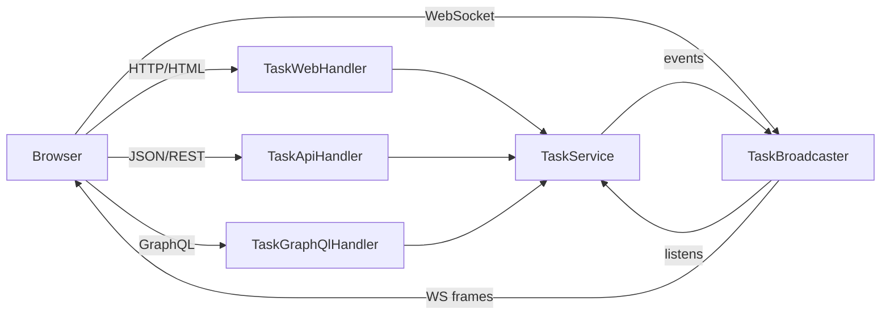
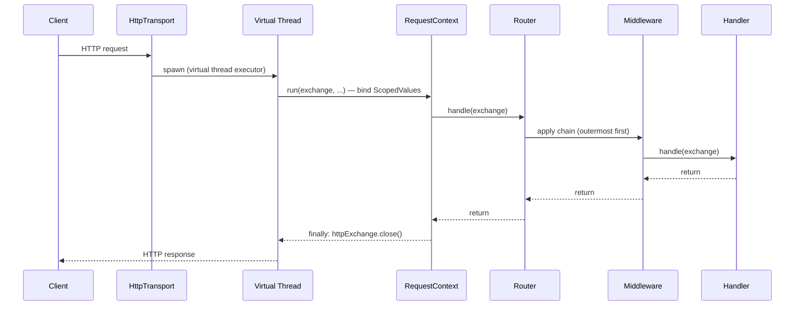
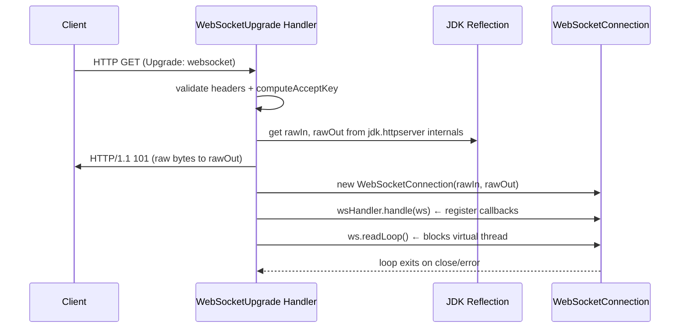

# Codebase Map

> Auto-generated by Cartographer. Last mapped: 2026-04-11

## System Overview

```mermaid
graph TB
    subgraph Core
        Foundation[serve-foundation<br/>contracts + routing]
        TransHTTP[serve-transport-http<br/>jdk.httpserver adapter]
        TransJSON[serve-transport-json<br/>Jackson body I/O]
        Application[serve-application<br/>lifecycle + DI]
        Testing[serve-testing<br/>integration test support]
    end

    subgraph Protocol
        WS[serve-websocket<br/>RFC 6455 WebSocket]
        SSE[serve-sse<br/>Server-Sent Events]
        MCP[serve-mcp<br/>Model Context Protocol]
        LSP[serve-lsp<br/>Language Server Protocol]
        GraphQL[serve-graphql<br/>GraphQL over HTTP]
    end

    subgraph Middleware
        CORS[serve-cors]
        Security[serve-security]
        Compression[serve-compression]
        Logging[serve-logging]
        Health[serve-health]
        Static[serve-static]
    end

    subgraph Templates
        Template[serve-template<br/>engine SPI]
        JTE[serve-jte<br/>JTE implementation]
        HTMX[serve-htmx<br/>HTMX headers]
    end

    Example[serve-example<br/>demo app]

    Foundation --> TransHTTP
    Foundation --> TransJSON
    TransHTTP --> Application
    Foundation --> Application
    Foundation --> Testing
    TransHTTP --> Testing

    Foundation --> WS
    Foundation --> SSE
    Foundation --> MCP
    SSE --> MCP
    Foundation --> LSP
    Foundation --> GraphQL

    Foundation --> CORS
    Foundation --> Security
    Foundation --> Compression
    Foundation --> Logging
    Foundation --> Health
    Foundation --> Static
    Foundation --> Template
    Template --> JTE
    Foundation --> HTMX

    Application --> Example
    TransJSON --> Example
    WS --> Example
    GraphQL --> Example
    CORS --> Example
    Security --> Example
    Compression --> Example
    Logging --> Example
    Health --> Example
    JTE --> Example
    HTMX --> Example
```



## Directory Structure

```
serve.build/
├── serve-foundation/           Core contracts: Exchange, Handler, Router, Middleware, errors, options
├── serve-transport-http/       jdk.httpserver ↔ foundation adapter; virtual thread dispatcher
├── serve-transport-json/       Jackson body reader/writer injected via Exchange attributes
├── serve-application/          Lifecycle (start/stop), DI integration, JVM shutdown hook, Launcher
├── serve-testing/              TestServer (ephemeral port), TestRequest, TestResponse + AssertJ
│
├── serve-websocket/            RFC 6455 WebSocket; frame codec; raw stream extraction via reflection
├── serve-sse/                  Server-Sent Events; SseEmitter, SseEvent, SseUpgrade handler factory
├── serve-mcp/                  Model Context Protocol (JSON-RPC 2.0 over HTTP POST)
├── serve-lsp/                  Language Server Protocol (Content-Length framing over stdio/TCP)
├── serve-graphql/              GraphQL over HTTP via graphql-java; SDL-first; GraphiQL IDE handler
│
├── serve-cors/                 CORS with origin/method/header allowlists + preflight (OPTIONS)
├── serve-security/             Security headers (CSP, HSTS, X-Frame-Options, …)
├── serve-compression/          Transparent gzip/deflate; buffer-and-compress; WebSocket passthrough
├── serve-logging/              Access log; nanosecond timing; slow-request threshold; path exclusions
├── serve-health/               Liveness + readiness endpoints; JSON status output; HealthCheck SPI
├── serve-static/               Filesystem + classpath static file serving; ETag/304; path traversal guard
│
├── serve-template/             Engine-agnostic SPI: TemplateEngine, Template, TemplateOutput
├── serve-jte/                  JTE adapter (dev hot-reload + precompiled production modes)
├── serve-htmx/                 Typed HX-* request/response header wrappers + htmxOnly() guard
│
├── serve-example/              Full demo app: REST + GraphQL + WebSocket + JTE/HTMX UI + health
│
├── config/checkstyle/          Checkstyle rules
├── docs/                       CODEBASE_MAP.md, TODO.md
└── .github/workflows/          CI (PR check, snapshot publish, release)
```

## Module Guide

### serve-foundation

**Purpose:** Core abstractions — HTTP exchange contracts, routing DSL, middleware composition, error hierarchy, concurrency utilities, and server configuration options. No I/O; pure interfaces and thin value types.

**Entry point:** `RouterBuilder` → `Router` → `Handler`

**Key files:**

| File | Purpose |
|------|---------|
| `Exchange.java` | Paired request+response; typed attribute bag (key constants defined here) |
| `Handler.java` | `@FunctionalInterface`: `void handle(Exchange) throws Exception` |
| `Request.java` | Inbound: method, URI, headers, query params, cookies, body stream |
| `Response.java` | Outbound: status, headers, fluent `send`/`json`/`bodyAsStream` |
| `SimpleExchange.java` | `ConcurrentHashMap`-backed `Exchange` implementation |
| `Router.java` | Marker interface extending `Handler` (dispatches by path/method) |
| `RouterBuilder.java` | Fluent builder: `.get/.post/.put/.delete/.route/.middleware/.build()` |
| `Route.java` | Single route; compiles `{param}` patterns to regex at construction |
| `Middleware.java` | `@FunctionalInterface`: `Handler apply(Handler next)` |
| `ScopedValueMiddleware.java` | Binds a `ScopedValue<T>` for the request lifetime |
| `RequestContext.java` | Static `ScopedValue` holders: `EXCHANGE`, `REQUEST_ID`, `START_TIME`, `PRINCIPAL`, `TELEMETRY` |
| `Concurrent.java` | Structured concurrency fan-out: `fork(A,B)`, `forkAll(List)` |
| `HttpException.java` | Base `RuntimeException` with `int statusCode`; subclasses for 400/401/403/404/409/500 |
| `DefaultErrorHandler.java` | Plain-text error responses; logs non-`HttpException` at SEVERE |
| `Cookie.java` | Full Set-Cookie model; `Builder`; `deleteCookie()` default on `Response` |
| `TelemetryMiddleware.java` | Wraps each request in a `TelemetryRecorder` activity |
| `TlsConfig.java` | `SSLContext` wrapper; PKCS12 keystore factory |
| `ListenAddress/MaxRequestSize/ShutdownTimeout` | Typed `Option` records with safe defaults |

**Key patterns:**
- `ScopedValue` for request context — no `ThreadLocal`, works with virtual threads
- Structured concurrency (`StructuredTaskScope`) in `Concurrent`; `ScopedValue` propagates to subtasks
- Middleware as function composition — first-registered = outermost wrapper (applied in reverse)
- `{param}` route patterns compiled to regex at `Route` construction time; prefix routes append `(/.*)?$`
- Attribute bag on `Exchange` with typed `attribute(key, Class<T>)` access

**Exports:** `build.serve.foundation` (split into sub-packages)

**Dependencies:** `build.base.configuration`, `build.base.telemetry`, `java.logging`

---

### serve-transport-http

**Purpose:** Adapts `jdk.httpserver` to serve-foundation abstractions; virtual-thread request dispatch; TLS via `HttpsServer`.

**Key files:**

| File | Purpose |
|------|---------|
| `HttpTransport.java` | Wraps `HttpServer`/`HttpsServer`; registers catch-all `"/"` context; entry point for start/stop |
| `HttpRequest.java` | Implements `Request` over `com.sun.net.httpserver.HttpExchange` |
| `HttpResponse.java` | Implements `Response` over `com.sun.net.httpserver.HttpExchange` |

**Key patterns:**
- `Executors.newVirtualThreadPerTaskExecutor()` — one virtual thread per request
- `RequestContext.run(exchange, ...)` binds `EXCHANGE`, `REQUEST_ID`, `START_TIME` as `ScopedValue`s on every request
- Raw `HttpExchange` stashed under `Exchange.HTTP_EXCHANGE_ATTRIBUTE` for WebSocket/SSE upgrade handlers
- Only one `createContext("/")` — all routing delegated to the `Handler` (typically a `Router`)

**Gotchas:**
- `HttpRequest.queryParams()` does not URL-decode parameter names
- `HttpResponse.send(byte[])` auto-sets `Content-Type: text/plain; charset=utf-8` if absent
- `bodyAsStream()` calls `sendResponseHeaders(statusCode, 0)` — commits status and headers immediately

**Dependencies:** `build.serve.foundation` (transitive), `jdk.httpserver`, `build.base.logging`

---

### serve-transport-json

**Purpose:** Jackson JSON body reading/writing wired into `Exchange` attribute slots as a `Middleware`.

**Key files:**

| File | Purpose |
|------|---------|
| `JsonMiddleware.java` | Registers reader/writer as `BODY_READER_ATTRIBUTE`/`BODY_WRITER_ATTRIBUTE` on every exchange |
| `JsonBodyReader.java` | `ObjectMapper.readValue(InputStream, Class)` |
| `JsonBodyWriter.java` | `ObjectMapper.writeValueAsBytes(Object)` + sets `Content-Type: application/json` |
| `JsonErrorHandler.java` | `{"status","error","message"}` JSON; falls back to `DefaultErrorHandler` on serialization failure |

**Key patterns:**
- Plugin-point design: `JsonMiddleware` injects functions into `Exchange` attributes so foundation stays Jackson-free
- `ObjectMapper` is per-`JsonMiddleware` instance (thread-safe Jackson)

**Gotchas:**
- `bodyAsStream()` is consumed on first call — `exchange.bodyAs(T)` must not be called twice
- If `JsonMiddleware` is absent, `exchange.bodyAs()` / `exchange.sendBody()` throw `UnsupportedOperationException`

**Dependencies:** `build.serve.foundation` (transitive), `build.base.transport.json`, `com.fasterxml.jackson.databind` (transitive re-export)

---

### serve-application

**Purpose:** Top-level application layer: lifecycle (`start`/`stop`/`close`), DI integration, JVM shutdown hook, and a standalone `Launcher`.

**Key files:**

| File | Purpose |
|------|---------|
| `ServerApplication.java` | Interface + `Implementation` abstract class; override `configure()` to return a `Router` |
| `DependencyInjectionRouterBuilder.java` | `RouterBuilder` wrapper; accepts `Class<? extends Handler>` instantiated via DI at build time |
| `Launcher.java` | Standalone bootstrap without spawn.build platform; wires `InjectionFramework` + `Configuration` |

**Key patterns:**
- `configure()` is the single extension point; called lazily in `start()` after DI injection
- `CompletableFuture`-based lifecycle integrates with spawn.build platform
- `AtomicBoolean stopped` makes `stop()` idempotent
- Handler classes passed to `DependencyInjectionRouterBuilder` are resolved at `build()` time (not per-request) → effectively singleton-scoped

**Gotchas:**
- `@Inject` fields on the `Implementation` subclass are only populated when `Launcher` (or explicit `context.inject()`) is used
- `TlsConfig` is not injectable via `ConfigurationResolver` — must be passed explicitly to the `start(...)` TLS overload
- Module opens `build.serve.application` to `build.codemodel.injection` for reflective field injection

**Dependencies:** `build.serve.foundation`, `build.serve.transport.http`, `build.spawn.application`, `build.codemodel.injection`, `jakarta.inject`, `build.base.telemetry.*`

---

### serve-testing

**Purpose:** Integration test helpers — real `HttpTransport` on an ephemeral port, fluent request builder, fluent response assertions.

**Key files:**

| File | Purpose |
|------|---------|
| `TestServer.java` | `AutoCloseable`; binds `127.0.0.1:0`; three factory overloads: `of(Handler)`, `of(Router)`, `of(RouterBuilder)` |
| `TestRequest.java` | Fluent builder using `HttpURLConnection`; error stream read for 4xx/5xx bodies |
| `TestResponse.java` | AssertJ-style assertions: `assertStatus()`, `assertBody()`, `assertHeader()`, `bodyAs(Class<T>)` |

**Gotchas:**
- `TestServer.stop(0)` = zero-second drain (immediate); fine for tests
- `TestResponse.header(name)` is case-sensitive
- Multi-value headers (e.g. `Set-Cookie`) lose all but the last value in the response headers map

**Dependencies:** `build.serve.foundation` (transitive), `build.serve.transport.http`, JUnit 5 (transitive), AssertJ (transitive), Jackson

---

## Protocol Modules

### serve-websocket

**Purpose:** RFC 6455 WebSocket support — opening handshake, frame codec, bidirectional connection lifecycle.

**Key files:**

| File | Purpose |
|------|---------|
| `WebSocketUpgrade.java` | Static factory `upgrade(WebSocketHandler)` → `Handler`; performs HTTP 101 handshake |
| `WebSocket.java` | Public connection interface: `sendText`, `sendBinary`, `ping`/`pong`, event callbacks, `isOpen()` |
| `WebSocketConnection.java` | Internal implementation; owns raw I/O streams; frame read loop |
| `WebSocketFrame.java` | RFC 6455 frame codec: parse + serialize; payload masking; fragmentation reassembly |
| `WebSocketHandler.java` | `@FunctionalInterface`: `void handle(WebSocket) throws Exception` |

**Request flow:**
```
HTTP GET /ws  (Upgrade: websocket)
  → WebSocketUpgrade.upgrade(wsHandler)
    → validate headers → computeAcceptKey(SHA-1 + GUID) → write 101 to rawOut
    → reflect into jdk.httpserver internals to get raw streams
    → new WebSocketConnection(rawIn, rawOut)
    → wsHandler.handle(wsConnection)   ← register callbacks here
    → wsConnection.readLoop()          ← blocks virtual thread; dispatches frames to callbacks
```

**Gotchas:**
- **Uses reflection against `jdk.httpserver` internals** (`impl`, `connection`, `getRawOutputStream`, `raw`) — can break on JDK updates. The reflection result is cached; first failure is a `RuntimeException`.
- `WebSocketHandler.handle()` must register all listeners before returning — the read loop starts immediately after
- Hard 16 MiB per-frame limit; no large-message fragmented receive
- Requires `Exchange.HTTP_EXCHANGE_ATTRIBUTE` populated by `HttpTransport`; unusable with stub transports

**Dependencies:** `build.serve.foundation` (transitive), `jdk.httpserver`, `java.net.http`

---

### serve-sse

**Purpose:** Server-Sent Events (RFC 8895) — streaming text events from server to client.

**Key files:**

| File | Purpose |
|------|---------|
| `SseUpgrade.java` | Static factory `sse(SseHandler)` → `Handler`; sets SSE headers + opens streaming body |
| `SseEmitter.java` | Public write interface: `send(String)`, `send(SseEvent)`, `isOpen()`, `close()` |
| `SseEmitterImpl.java` | Internal `OutputStream`-backed implementation; `synchronized` writes |
| `SseEvent.java` | Immutable record: `data`, `id`, `event`, `retry`; `serialize()` → text/event-stream bytes |
| `SseHandler.java` | `@FunctionalInterface`: `void handle(SseEmitter) throws Exception` |

**Flow:**
```
GET /events
  → SseUpgrade.sse(sseHandler)
    → set Content-Type: text/event-stream, Cache-Control: no-cache, X-Accel-Buffering: no
    → httpExchange.sendResponseHeaders(200, 0)  ← opens streaming body
    → new SseEmitterImpl(httpExchange.getResponseBody())
    → sseHandler.handle(emitter)  ← user calls emitter.send(...) in a loop
    → finally: emitter.close()
```

**Gotchas:**
- `X-Accel-Buffering: no` disables nginx proxy buffering — important for streaming through reverse proxies
- No `\r` character validation in `SseEvent.data` — could corrupt framing
- Requires `Exchange.HTTP_EXCHANGE_ATTRIBUTE` (same constraint as WebSocket)

**Dependencies:** `build.serve.foundation` (transitive), `jdk.httpserver`, `java.net.http`

---

### serve-mcp

**Purpose:** Model Context Protocol server — JSON-RPC 2.0 over HTTP POST; exposes callable tools to AI clients.

**Key files:**

| File | Purpose |
|------|---------|
| `McpServer.java` | Builder + `handler()` factory; implements `initialize`, `tools/list`, `tools/call` |
| `McpTool.java` | Interface: `name()`, `description()`, `inputSchema()` (Jackson `ObjectNode`), `call(JsonNode)` |
| `McpContent.java` | Sealed interface: `Text(String)` and `Image(String data, String mimeType)` |
| `McpToolResult.java` | `record(List<McpContent>, boolean isError)`; `text(String)` / `error(String)` factories |
| `McpTools.java` | Static helpers for building JSON Schema `ObjectNode` input schemas |
| `McpServerInfo.java` | `record(String name, String version)` — server identity in `initialize` response |

**Protocol:**
```
POST /mcp  {"jsonrpc":"2.0","id":1,"method":"initialize","params":{...}}
  → McpServer.handler()
    → switch(method): initialize / tools/list / tools/call / → -32601 error
    → HTTP 200 with {"jsonrpc":"2.0","id":1,"result":{...}}

Notifications (no "id"): → HTTP 202, no body
```

**Gotchas:**
- `tool.call()` exceptions produce `McpToolResult.error(e.getMessage())` — a `NullPointerException` yields `"null"` as error text
- `build.serve.sse` is declared as a dependency but currently unused — a streaming/SSE transport for MCP is likely forthcoming (MCP 2025 spec supports SSE)
- Protocol version hardcoded: `"2025-03-26"`
- No batched JSON-RPC support

**Dependencies:** `build.serve.foundation` (transitive), `build.serve.sse`, `com.fasterxml.jackson.databind` (transitive)

---

### serve-lsp

**Purpose:** Language Server Protocol server — Content-Length–framed JSON-RPC over stdio or TCP sockets.

**Key files:**

| File | Purpose |
|------|---------|
| `LspTransport.java` | `stdio(LspServer)`, `tcp(LspServer, int)`, `run(LspServer, in, out)` — the read/dispatch loop |
| `LspServer.java` | Builder/holder for typed handler functions for all standard LSP methods |
| `LspContext.java` | Interface for server→client notifications: `publishDiagnostics`, `showMessage`, etc. |
| `*.java` (params) | 17 request/notification param records (Jackson-deserializable) |
| `types/*.java` | 28 LSP types (records + enums) mirroring the LSP specification |

**Transport:**
```
stdin/stdout  OR  ServerSocket(port) → virtual thread per connection
  → LspTransport.run()
    → read "Content-Length: N\r\n\r\n" header block
    → read N chars from BufferedReader
    → parse JSON-RPC → dispatch → writeMessage(result)
    → "exit" → Runtime.halt(0|1)
```

**LSP methods supported (via `LspServer.Builder`):**
- Lifecycle: `initialize`, `initialized`, `shutdown`, `exit`
- Document sync: `textDocument/didOpen`, `didChange`, `didClose`, `didSave`
- Language features: `completion`, `hover`, `definition`, `references`, `highlights`, `rename`
- Code intelligence: `codeAction`, `formatting`, `rangeFormatting`, `foldingRange`, `selectionRange`, `inlayHint`
- Symbols: `documentSymbol`, `workspaceSymbol`, `executeCommand`
- Server-push: `publishDiagnostics`, `showMessage`, `logMessage`

**Gotchas:**
- `dispatchRequest` and `dispatchNotification` silently swallow all exceptions — errors return `{"result":null}` rather than a proper JSON-RPC `-32603` error
- `BufferedReader` reads chars; LSP `Content-Length` is in bytes — correct for ASCII/UTF-8 but may fail for messages with multi-byte characters at the boundary
- `Runtime.halt()` on `exit` — hard JVM kill, no shutdown hooks run
- `LspServer` does not expose a `Handler`/`Exchange` entry point — it is stream-oriented, not HTTP-oriented

**Dependencies:** `build.serve.foundation`, `com.fasterxml.jackson.databind`

---

### serve-graphql

**Purpose:** GraphQL over HTTP via graphql-java; SDL-first schema definition; GraphiQL IDE handler.

**Key files:**

| File | Purpose |
|------|---------|
| `GraphQlHandler.java` | `graphql(GraphQlSchema)` → `Handler`; reads request body, executes, writes JSON response |
| `GraphQlSchema.java` | Builder: `builder(sdl)` + `.fetcher(type, field, DataFetcher)` + `.build()` |
| `GraphiQlHandler.java` | `graphiql(endpoint)` → `Handler`; serves pre-rendered HTML with CDN GraphiQL |
| `DataFetcher.java` | `@FunctionalInterface`: `T fetch(DataFetchingEnvironment)` |
| `DataFetchingEnvironment.java` | Thin API over graphql-java: `getArgument`, `getSource`, `getField` |
| `GraphQlRequest.java` | `record(String query, String operationName, Map<String,Object> variables)` |
| `GraphQlResult.java` | `record(Map<String,Object> data, @JsonInclude(NON_EMPTY) List<GraphQlError> errors)` |
| `GraphQlError.java` | `record(String message, List<String> path)` |

**Key patterns:**
- SDL-first: schema defined as a text block string; graphql-java parses at build time
- Adapter: `adaptFetcher()` converts serve `DataFetcher` to graphql-java `DataFetcher` — keeps graphql-java fully encapsulated
- `static final ObjectMapper MAPPER` — shared, thread-safe; zero-allocation after startup
- `@JsonInclude(NON_EMPTY)` on errors — omitted from JSON when empty (correct GraphQL over HTTP spec)

**Gotchas:**
- `GraphQlHandler` has no HTTP method guard — GET requests cause Jackson parse exceptions
- `GraphQlSchema.execute()` is synchronous; graphql-java async pipeline not exposed
- GraphiQL loads from `unpkg.com` CDN — requires internet access; endpoint injected raw (no HTML escaping)
- Introspection always enabled, no query depth/complexity limits

**Dependencies:** `build.serve.foundation` (transitive), `com.fasterxml.jackson.databind`, `com.graphqljava`

---

## Middleware Modules

All middleware modules `require transitive build.serve.foundation`. All implement `Middleware` (`Handler apply(Handler next)`).

### Middleware Composition

`RouterBuilder.middleware()` calls stack the wrappers: **first-registered = outermost**. Execution order for a request:

```
Logging → CORS → Security(pre-call) → Compression(buffer) → JSON(inject)
  → [handler executes]
→ JSON(post) → Compression(compress) → Security(set headers) → CORS(post) → Logging(log)
```

### serve-cors

| | |
|---|---|
| **Purpose** | CORS headers + OPTIONS preflight handling |
| **Factory** | `CorsMiddleware.builder()` or `CorsMiddleware.allowAll()` |
| **Patterns** | Pre-only (short-circuits OPTIONS); wildcard vs explicit origin matching; `Vary: Origin` on credentialed requests |
| **Gotcha** | `allowCredentials + anyOrigin` rejected at build time (CORS spec); `allowAll()` has no production warning |

### serve-security

| | |
|---|---|
| **Purpose** | Browser security headers on every response |
| **Factory** | `SecurityHeadersMiddleware.defaults()` or `SecurityHeadersMiddleware.builder()` |
| **Patterns** | Post-handler; sets X-Frame-Options, HSTS, CSP (if configured), Referrer-Policy, COOP, CORP, etc. |
| **Gotcha** | Default HSTS lacks `; includeSubDomains; preload`; post-handler placement overwrites any headers set by inner handlers |

**Default headers set:**

| Header | Default value |
|---|---|
| X-Frame-Options | `DENY` |
| X-Content-Type-Options | `nosniff` |
| X-XSS-Protection | `0` |
| Strict-Transport-Security | `max-age=63072000` |
| Referrer-Policy | `strict-origin-when-cross-origin` |
| Cross-Origin-Opener-Policy | `same-origin` |
| Cross-Origin-Resource-Policy | `same-origin` |

### serve-compression

| | |
|---|---|
| **Purpose** | Transparent gzip/deflate based on `Accept-Encoding` |
| **Factory** | `CompressionMiddleware.defaults()` (gzip only) or `CompressionMiddleware.builder()` |
| **Patterns** | Around-handler; buffer-and-compress; WebSocket upgrade passthrough; `Vary: Accept-Encoding` always set |
| **Gotcha** | `BufferingResponse.bodyAsStream()` throws `UnsupportedOperationException` — streaming handlers break; `response.json()` bypasses compression; minimum size threshold: 1024 bytes |

**Compressible MIME types by default:** `text/*`, `application/json`, `application/javascript`, `application/xml`, `image/svg+xml`

### serve-logging

| | |
|---|---|
| **Purpose** | Access log with method, path, status, duration; slow-request warnings |
| **Factory** | `RequestLoggingMiddleware.defaults()` or `RequestLoggingMiddleware.builder()` |
| **Patterns** | Around-handler; nanosecond timer; slow-request threshold → WARN log; path exclusion set (exact match) |
| **Gotcha** | `includeQueryString` defaults to `true` — API keys/tokens in URLs will appear in logs |

### serve-health

| | |
|---|---|
| **Purpose** | `/health/live` (always UP) and `/health/ready` (executes registered checks) endpoints |
| **Factory** | `HealthHandler.liveness()`, `HealthHandler.readiness(HealthCheck...)`, `HealthHandler.create()` (builder returning a mountable `Router`) |
| **Patterns** | `HealthCheck` is a `@FunctionalInterface`; exceptions from checks silently count as DOWN; JSON built with `StringBuilder` |
| **Gotcha** | Check names are not HTML/JSON-escaped in the hand-built JSON response; exception details from failing checks are discarded |

### serve-static

| | |
|---|---|
| **Purpose** | Filesystem and classpath static files; ETag/304 cache validation |
| **Factory** | `StaticFileHandler.directory(path)`, `StaticFileHandler.resources(anchorClass, prefix)` |
| **Patterns** | Implements `Router` (not just `Handler`) for prefix stripping; double path traversal defense (string `..` check + canonical path prefix check); ETag = hex(lastModified) + hex(size) |
| **Gotcha** | Reads entire file into `byte[]` on every request — no streaming, no range request support; classpath mode has no ETag/304 |

---

## Template Modules

### serve-template (SPI)

**Purpose:** Engine-agnostic SPI. Zero dependency on any template library.

```
TemplateEngine (@FunctionalInterface)
  └─ template(String name): Template
Template (@FunctionalInterface)
  └─ render(TemplateOutput output, Map<String,Object> params): void
TemplateOutput (interface)
  ├─ StringTemplateOutput  — public, StringBuilder-backed (TemplateOutput.capture())
  ├─ WriterTemplateOutput  — package-private
  └─ OutputStreamTemplateOutput — package-private
TemplateHandler (Handler)
  └─ render(engine, name, params)  or  render(engine, name, Function<Exchange, Map>)
     → always buffers via capture() before sending; hardcodes Content-Type: text/html; charset=utf-8
```

**Gotcha:** `TemplateHandler` always buffers the full rendered HTML in memory before sending — no streaming path.

### serve-jte

**Purpose:** JTE (Java Template Engine) implementation of the serve-template SPI.

| Factory | Mode |
|---|---|
| `JteTemplateEngine.development(Path)` | Hot-reload; `DirectoryCodeResolver`; temp dir for compiled classes |
| `JteTemplateEngine.production(Class<?>)` | Precompiled; classloader of the anchor class |
| `JteTemplateEngine.production(Path)` | Precompiled; from a directory |

**Adapter chain:**
```
TemplateEngine.template(name)
  → JteTemplateEngine: hasTemplate() + new JteTemplate(jteEngine, name)
Template.render(output, params)
  → JteTemplate: jteEngine.render(name, params, new JteOutputAdapter(output))
JteOutputAdapter.writeContent(String)
  → delegates to serve-template TemplateOutput
```

**Gotcha:** `ContentType.Html` is hardwired — JTE auto-escaping always active; unsuitable for non-HTML output without bypassing the engine.

### serve-htmx

**Purpose:** Typed wrappers for HTMX `HX-*` request/response headers; `htmxOnly()` guard middleware.

| Type | Role |
|---|---|
| `HtmxHeaders` | Constants for all HX-* header names |
| `HtmxRequest.of(Request)` | Typed accessors: `isHtmxRequest()`, `getTarget()`, `getCurrentUrl()`, etc. |
| `HtmxResponse.of(Response)` | Fluent setters: `pushUrl()`, `redirect()`, `retarget()`, `trigger()`, etc. |
| `HtmxMiddleware.htmxOnly()` | Guard that returns 400 if `HX-Request: true` is absent |

**Gotcha:** `HX-Trigger` is used both as a request header (trigger element ID) and a response header (fire event). The `HtmxResponse.trigger(eventName)` setter is for the response direction.

---

## Example Application

**Module:** `serve-example` — a complete, runnable demo showing all framework capabilities.

### Architecture



### Route Map

```
GET  /                          → full page (JTE: tasks.jte)
POST /tasks                     → create task, return partial (JTE: taskItem.jte)
PUT  /tasks/{id}/toggle         → toggle, return partial (JTE: taskItem.jte)
DELETE /tasks/{id}              → delete, return empty 200 (HTMX outerHTML removes element)

GET  /api/tasks                 → JSON list
POST /api/tasks                 → JSON create → 201
PUT  /api/tasks/{id}            → JSON update → 200
DELETE /api/tasks/{id}          → 204

POST /graphql                   → GraphQL execution
GET  /graphiql                  → GraphiQL IDE

GET  /ws/tasks                  → WebSocket upgrade (broadcasts mutation events as JSON)

GET  /health/live               → {"status":"UP"}
GET  /health/ready              → {"status":"UP","checks":{...}}
```

### Middleware Stack (from `ExampleApp.configure()`)

```
1. RequestLoggingMiddleware.defaults()   outermost — times full request
2. CorsMiddleware.allowAll()
3. SecurityHeadersMiddleware.defaults()
4. CompressionMiddleware.defaults()
5. JsonMiddleware                        innermost — body read/write support
```

### Key Domain Types

| Type | Pattern |
|---|---|
| `Task(long id, String title, boolean done)` | Immutable Java record |
| `TaskService` | `ConcurrentHashMap` + `AtomicLong` + `CopyOnWriteArrayList<Consumer<TaskEvent>>` |
| `TaskEvent(String type, Task task)` | Nested record in `TaskService`; types: `"created"`, `"updated"`, `"deleted"` |
| `TaskBroadcaster` | `CopyOnWriteArrayList<WebSocket>` sessions; dead session cleanup on broadcast |

---

## Data Flow Diagrams

### HTTP Request Lifecycle



### WebSocket Upgrade Flow



---

## Conventions

- **Indentation:** 4 spaces everywhere
- **Null policy:** `Optional<T>` in public APIs; internal code avoids null by convention
- **Test naming:** methods must start with `should` or `shouldNot`
- **Test implementation:** no mocks; stub/test implementations (`TestRequest`, `TestResponse`, `TestServer`)
- **Module structure:** all modules have explicit `requires`/`exports`
- **Middleware:** `first-registered = outermost` (applied in reverse within `RouterBuilder`)
- **Factories over constructors:** static factory methods (`of`, `builder`, `defaults`) used consistently
- **Records for options and value types:** `ListenAddress`, `MaxRequestSize`, `SseEvent`, `Task`, etc.
- **`@FunctionalInterface` for extension points:** `Handler`, `Middleware`, `DataFetcher`, `HealthCheck`, `SseHandler`, `WebSocketHandler`, `TemplateEngine`, `Template`

---

## Gotchas

| Module | Issue |
|---|---|
| `serve-websocket` | Reflection against `jdk.httpserver` internals — names `impl`, `connection`, `getRawOutputStream`, `raw` can break on JDK updates |
| `serve-websocket` | Hard 16 MiB per-frame limit; no fragmented large-message receive |
| `serve-compression` | `BufferingResponse.bodyAsStream()` throws `UnsupportedOperationException` — breaks streaming handlers |
| `serve-transport-http` | `HttpRequest.queryParams()` does not URL-decode parameter names |
| `serve-transport-json` | Request body stream consumed on first `exchange.bodyAs()` — cannot be called twice |
| `serve-application` | Handler classes in `DependencyInjectionRouterBuilder` are resolved once at `build()` time — effectively singleton-scoped |
| `serve-lsp` | `dispatchRequest` swallows all exceptions — error returns `{"result":null}` not a proper JSON-RPC error |
| `serve-lsp` | `Content-Length` is in bytes but `BufferedReader.read(char[])` reads chars — may misalign on multi-byte UTF-8 |
| `serve-graphql` | No HTTP method guard on `GraphQlHandler` — GET causes a Jackson parse exception |
| `serve-security` | Default HSTS missing `; includeSubDomains; preload` |
| `serve-logging` | `includeQueryString` defaults to `true` — API keys in URLs will appear in logs |
| `serve-health` | Check names are not JSON-escaped in hand-built JSON; exception details from failing checks are silently discarded |
| `serve-mcp` | `tool.call()` NPE → error message is the string `"null"` |
| `serve-jte` | `JteTemplateEngine.template()` calls `hasTemplate()` on every invocation — no caching in the SPI layer |
| `serve-testing` | Multi-value response headers (e.g. `Set-Cookie`) lose all but the last value |

---

## Navigation Guide

**To add a new HTTP endpoint:**
1. Create a `Handler` or `@FunctionalInterface` lambda
2. Register in `RouterBuilder` via `.get(path, handler)` / `.post(path, handler)` etc.
3. Mount via `ServerApplication.Implementation.configure()`

**To add new middleware:**
1. Implement `Middleware` (`Handler apply(Handler next)`) in a new module
2. Register with `RouterBuilder.middleware(new MyMiddleware(...))` — registers before route setup for outermost placement

**To add a new route with path params:**
- Use `{name}` syntax: `.get("/items/{id}", exchange -> { String id = exchange.request().pathParam("id"); ... })`

**To add a WebSocket endpoint:**
```java
.get("/ws/path", WebSocketUpgrade.upgrade(ws -> {
    ws.onText(msg -> ws.sendText("echo: " + msg));
}))
```

**To add an SSE endpoint:**
```java
.get("/events", SseUpgrade.sse(emitter -> {
    while (running) { emitter.send(SseEvent.of("update", data)); Thread.sleep(1000); }
}))
```

**To add a new template:**
1. Add a `.jte` file in `src/main/jte/`
2. Use `TemplateHandler.render(engine, "name.jte", exchange -> Map.of("key", value))` as the route handler

**To write an integration test:**
```java
try (var server = TestServer.of(myRouter)) {
    var response = server.request().path("/api/items").send();
    response.assertStatus(200).assertBodyContains("items");
}
```

**To expose MCP tools:**
```java
var mcp = McpServer.builder("my-server", "1.0")
    .tool(new MyMcpTool())
    .build();
routerBuilder.post("/mcp", mcp.handler());
```

**To implement a language server:**
```java
var lsp = LspServer.builder()
    .onHover((params, ctx) -> Hover.of("documentation here"))
    .build();
LspTransport.stdio(lsp);  // or LspTransport.tcp(lsp, 3939)
```

**To add health checks:**
```java
var health = HealthHandler.create()
    .readiness(HealthCheck.of("db", () -> db.ping()))
    .build();
routerBuilder.route("/health", health);
```

**To modify CORS:**
- Dev: `CorsMiddleware.allowAll()`
- Prod: `CorsMiddleware.builder().allowOrigin("https://app.example.com").allowMethods("GET","POST").build()`

**To run tests for a single module:**
```bash
./mvnw -pl serve-foundation test
```
